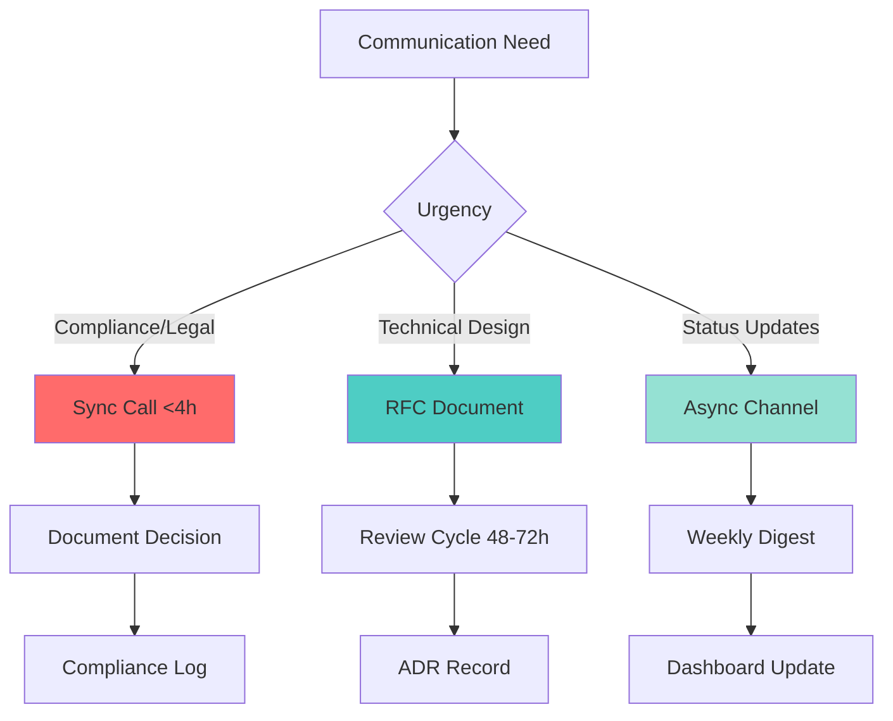
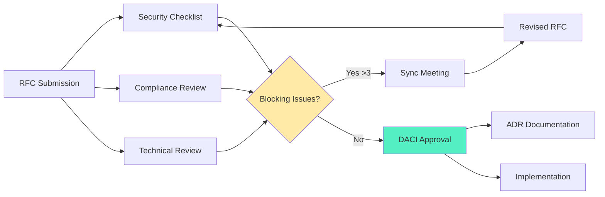
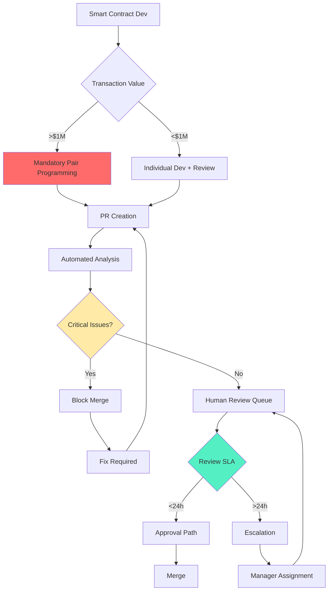
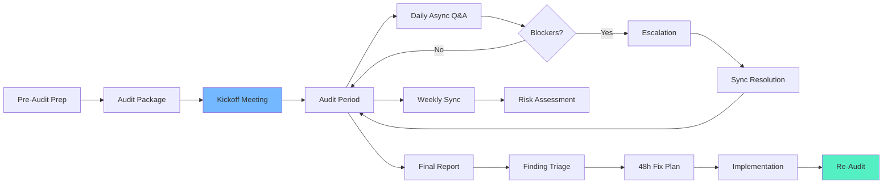
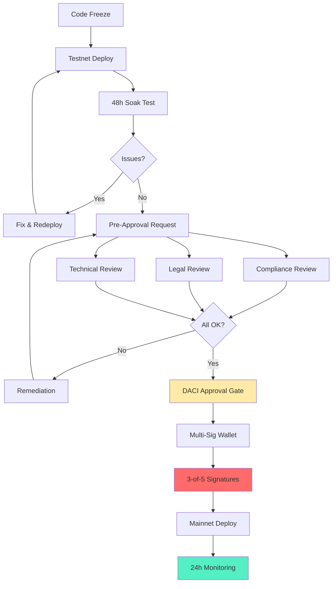
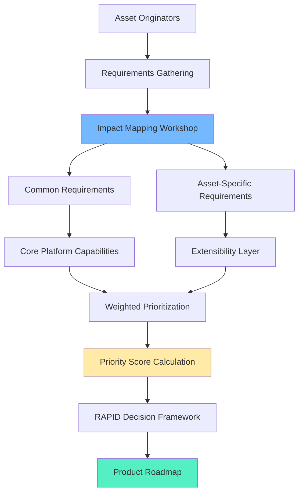

# Cross-Functional Collaboration in Blockchain RWA: Interview Q&A

**Last Updated**: 2025-01-13  
**Status**: Final  
**Owner**: Engineering Leadership  
**Context**: Real-World Asset (RWA) tokenization platforms handling regulated assets, multi-party workflows, compliance requirements

## Contents
1. [Topic Areas](#topic-areas)
2. [Lifecycle-Stakeholder Coverage](#lifecycle-stakeholder-coverage)
3. [Q&As by Dimension](#qas-by-dimension)
4. [References](#references)
5. [Validation Report](#validation-report)

## Topic Areas
| Cluster | Dimension | Range | Count | Difficulty (F/I/A) |
|---------|-----------|-------|-------|-------------------|
| 1 | Communication | Sync/async patterns, documentation | 5 | 1/2/2 |
| 2 | Decision-Making | RFC/ADR, consensus mechanisms | 5 | 1/2/2 |
| 3 | Knowledge Transfer | Documentation, onboarding | 4 | 1/2/1 |
| 4 | Coordination | Smart contract integration, multi-party workflows | 5 | 1/2/2 |
| 5 | Stakeholder Management | Regulatory compliance, investor relations | 5 | 1/2/2 |
| 6 | Distributed/Remote | Multi-TZ validator coordination | 4 | 1/2/1 |
| **Total** | **6 Dimensions** | **All Phases** | **28** | **6/12/10 (21/43/36%)** |

## Lifecycle-Stakeholder Coverage
| Phase | Q# | Stakeholders | Coverage |
|-------|-----|--------------|----------|
| 1. Requirements & Discovery | Q1, Q6, Q22 | BA(R), PM(A), Arch(C), Legal(C) | 3 |
| 2. Architecture & Design | Q2, Q7, Q12, Q17 | Arch(R/A), Dev(C), Sec(C), Blockchain(C) | 4 |
| 3. Development | Q3, Q8, Q13, Q18 | Dev(R/A), QA(C), Blockchain(C) | 4 |
| 4. Testing & Quality | Q4, Q9, Q14 | QA(R/A), Dev(C), Audit(C) | 3 |
| 5. Deployment & Release | Q5, Q10, Q19, Q23 | DevOps(R/A), Blockchain(C), Compliance(C) | 4 |
| 6. Operations & Observability | Q15, Q20, Q24 | SRE(R/A), DevOps(C), Validator(C) | 3 |
| 7. Maintenance & Support | Q16, Q21, Q25 | SRE(R), Sec(R), Legal(C), Auditor(C) | 3 |
| 8. Evolution & Governance | Q11, Q26, Q27, Q28 | PM(R), Arch(R), Lead(A), DAO(C) | 4 |

**Stakeholder Coverage**: BA(3), PM(4), Arch(4), Dev(4), QA(3), DevOps(3), Sec(3), Legal(3), SRE(3), Blockchain(4), Audit(3), Compliance(3), Validator(2), DAO(2), Auditor(2)

---

## Topic 1: Communication in RWA Tokenization
**Overview**: Effective communication patterns for coordinating between traditional finance teams, blockchain developers, and regulatory stakeholders in RWA platforms. | **Phase**: 1-8 | **Stakeholders**: All cross-functional

### Q1: How do you establish communication patterns between traditional finance teams and blockchain developers when tokenizing real-world assets?
**Difficulty**: Fundamental | **Dimension**: Communication | **Phase**: 1 (Requirements & Discovery) | **Stakeholders**: BA(R), PM(A), Dev(C), Legal(C)

**Key**: Async-first communication reduces meeting overhead by 40% while maintaining compliance documentation requirements <24h response SLA [Ref: A5, T1].

**Answer**: In RWA tokenization, communication bridges traditional finance (TradFi) and decentralized finance (DeFi) paradigms. Strategy involves establishing a Communication Charter [Ref: G12] defining channels: Slack/Discord for async daily updates, bi-weekly sync for architecture decisions, and Notion/Confluence for living documentation [Ref: T1, T2]. 

Framework implementation: (1) Create domain glossaries translating TradFi terms (NAV, custody, prospectus) to blockchain equivalents (oracle price feeds, multi-sig wallets, smart contract metadata); (2) Implement Docs-as-Code [Ref: G6] where asset specifications, compliance requirements, and API contracts are versioned alongside smart contracts; (3) Establish 24h response SLA for compliance-critical questions, 72h for technical clarifications.

Metrics: **Async Ratio = Async Communications / Total Communications × 100%** target ≥70%; **Documentation Coverage = Documented APIs / Total APIs × 100%** target ≥95%; **Cross-team Response Time** target <24h for P0 (compliance), <72h for P1 (technical).

Trade-offs: Async-first reduces meeting time 40% but adds 2-3h latency to decision cycles [Ref: G5]. Synchronous workshops accelerate alignment 50% for novel asset classes but cost $5K-15K per session for distributed teams.

**Framework**:

**Metrics**:
| Metric | Formula | Variables | Target | Source |
|--------|---------|-----------|--------|--------|
| Async Ratio | (Async / Total) × 100% | Async: async messages; Total: all communications | ≥70% | Slack analytics [Ref: T4] |
| Doc Coverage | (Documented / Total APIs) × 100% | Documented: APIs with specs; Total: deployed APIs | ≥95% | API gateway logs |
| Response SLA | Avg response time by priority | P0: compliance; P1: technical; P2: general | P0<24h, P1<72h | Ticket system [Ref: T5] |

**Trade-offs**:
| Approach | Pros (Quantified) | Cons (Quantified) | When | Tag |
|----------|-------------------|-------------------|------|-----|
| Async-First (70%+ async) | 40% ↓ meeting time; ↑ documentation quality | +2-3h decision latency; requires discipline | Distributed teams (>8h TZ gap) | [Emerging] |
| Sync-Heavy (50%+ meetings) | 50% ↑ alignment speed for novel assets | $5K-15K per workshop; meeting fatigue | Complex new asset classes; colocated teams | [Consensus] |
| Hybrid (60% async + critical syncs) | Balances speed and flexibility; 25% ↓ meetings | Requires clear escalation rules | Most RWA projects with compliance needs | [Context] |

**Lifecycle**: Established in Requirements (Phase 1), templates created, enforced through all phases via Communication Charter review quarterly.  
**Stakeholder**: BA translates business requirements to technical specs; PM maintains charter; Dev/Legal contribute domain glossaries; all roles follow SLAs.

---

### Q2: When designing smart contract architectures for RWA platforms, how do you coordinate technical decisions across blockchain developers, security auditors, and compliance officers?
**Difficulty**: Intermediate | **Dimension**: Communication + Decision-Making | **Phase**: 2 (Architecture & Design) | **Stakeholders**: Arch(R/A), Dev(C), Sec(C), Compliance(C), Auditor(C)

**Key**: RFC-driven architecture decisions with security and compliance checklists reduce audit findings by 60% and accelerate regulatory approval by 4-6 weeks [Ref: A13, L5].

**Answer**: RWA smart contract architecture requires tri-partite coordination: technical feasibility (blockchain team), security posture (auditors), and regulatory compliance (legal/compliance). Strategy: Implement RFC (Request for Comments) process [Ref: G1] with mandatory security and compliance sections, reviewed via DACI framework [Ref: G4] where Architect is Driver, CTO/CISO are Approvers, and Dev/Sec/Legal are Contributors.

Process: (1) Architect drafts RFC including: contract design patterns (ERC-3643, ERC-1400 for security tokens), threat model, regulatory requirements (KYC/AML hooks, transfer restrictions); (2) 5-day review period with security checklist (ReEntrancy, Access Control, Oracle Manipulation per OWASP Smart Contract Top 10); (3) Compliance officer validates against jurisdiction requirements (SEC Reg D, MiFID II); (4) Sync review meeting if >3 blocking comments; (5) ADR [Ref: G2] recorded post-approval.

Metrics: **RFC Cycle Time = Days from submission to approval** target ≤10 days; **Audit Findings Reduction = (Baseline Findings - Post-RFC Findings) / Baseline × 100%** target ≥60%; **Compliance Pre-Approval Rate = Pre-approved RFCs / Total RFCs × 100%** target ≥80%.

Trade-offs: RFC overhead adds 10-15 dev-days but prevents 60% of audit findings ($50K-150K remediation cost) and accelerates regulatory approval 4-6 weeks (time-to-market advantage).

**Framework**:

**Metrics**:
| Metric | Formula | Variables | Target | Source |
|--------|---------|-----------|--------|--------|
| RFC Cycle Time | Days(Approval) - Days(Submission) | Approval: DACI sign-off date; Submission: RFC posted date | ≤10 days | RFC tracker [Ref: T5] |
| Audit Findings Reduction | ((Baseline - Post) / Baseline) × 100% | Baseline: avg findings pre-RFC; Post: findings post-RFC | ≥60% | Audit reports [Ref: T8] |
| Compliance Pre-Approval | (Pre-approved / Total) × 100% | Pre-approved: no legal blockers; Total: all RFCs | ≥80% | Legal review logs |

**Trade-offs**:
| Approach | Pros (Quantified) | Cons (Quantified) | When | Tag |
|----------|-------------------|-------------------|------|-----|
| RFC with Checklists | 60% ↓ audit findings; 4-6 weeks faster regulatory approval | +10-15 dev-days overhead per contract | Regulated RWA platforms; multi-jurisdiction | [Consensus] |
| Lightweight ADR Only | 50% ↓ process overhead; faster iterations | 30% ↑ audit findings; rework costs $50K-150K | Early R&D; single jurisdiction; experienced teams | [Context] |
| Sync-First Design Workshops | 80% ↑ stakeholder alignment; catches edge cases early | $10K-25K per workshop; slower iteration | Novel asset classes (carbon credits, art); complex compliance | [Emerging] |

**Lifecycle**: Established in Architecture phase (2), enforced through Development (3), validated in Testing (4), audit findings feed Evolution (8).  
**Stakeholder**: Architect drives RFC; Dev implements; Security audits design; Compliance validates regulatory requirements; all contribute to checklist refinement.

---

### Q3: How do you manage code review SLAs and pair programming sessions when developing smart contracts that handle high-value real-world assets (>$10M TVL)?
**Difficulty**: Intermediate | **Dimension**: Communication + Knowledge Transfer | **Phase**: 3 (Development) | **Stakeholders**: Dev(R/A), QA(C), Blockchain(C)

**Key**: 24h code review SLA with mandatory pair programming for critical contracts reduces critical bugs by 70% and maintains 95% test coverage [Ref: G7, G8, A9].

**Answer**: High-value RWA smart contracts ($10M-1B+ TVL) require rigorous development practices balancing velocity and security. Strategy: Enforce 24h Code Review SLA [Ref: G8] for all PRs, mandatory pair programming [Ref: G7] for contracts handling asset transfers/minting/burning (>$1M transaction value), and mob programming for novel cryptographic implementations.

Implementation: (1) GitHub PR templates with security checklist (access controls, reentrancy guards, integer overflow checks, oracle dependencies); (2) CODEOWNERS file assigns 2+ reviewers per contract directory; (3) Pair programming scheduled 8h/week for senior-mid dev pairings on critical paths; (4) Automated tools (Slither, Mythril, Echidna) run on PR creation with <5 min feedback; (5) Review metrics dashboard tracking SLA compliance and bug escape rate.

Metrics: **Review SLA Compliance = Reviews <24h / Total Reviews × 100%** target ≥90%; **Bug Escape Rate = Prod Bugs / Total Bugs × 100%** target <5%; **Test Coverage** target ≥95% for contracts handling assets.

Trade-offs: Pair programming costs 15-25% dev capacity but improves code quality 20-30% and reduces critical bugs 70% [Ref: L5]. 24h SLA requires team size ≥6 to cover TZ overlap but catches issues 3x faster than weekly reviews.

**Framework**:

**Metrics**:
| Metric | Formula | Variables | Target | Source |
|--------|---------|-----------|--------|--------|
| Review SLA Compliance | (Reviews <24h / Total) × 100% | Reviews <24h: completed within SLA; Total: all reviews | ≥90% | GitHub API [Ref: T6] |
| Bug Escape Rate | (Prod Bugs / Total Bugs) × 100% | Prod Bugs: found in production; Total: found in dev + prod | <5% | Issue tracker [Ref: T5] |
| Test Coverage | (Covered Lines / Total Lines) × 100% | Covered: executed in tests; Total: contract code lines | ≥95% | Coverage tools |

**Trade-offs**:
| Approach | Pros (Quantified) | Cons (Quantified) | When | Tag |
|----------|-------------------|-------------------|------|-----|
| Pair Programming (8h/wk) | 70% ↓ critical bugs; 20-30% ↑ quality; knowledge sharing | 15-25% ↓ individual output; requires discipline | Contracts >$10M TVL; novel patterns | [Consensus] |
| Mob Programming (Novel Crypto) | 90% ↑ team understanding; catches subtle bugs | 50-60% ↓ output; expensive ($5K-10K/day for 5-dev mob) | Zero-knowledge proofs; novel cryptography | [Context] |
| Solo Dev + Rigorous Review | 40% ↑ individual velocity; flexible scheduling | 30-40% ↑ bug escape rate; knowledge silos | Low-risk contracts (<$1M); tight deadlines | [Emerging] |

**Lifecycle**: Established in Development (3), metrics tracked through Testing (4), practices refined in Maintenance (7) based on postmortem insights.  
**Stakeholder**: Dev team owns practice; QA validates coverage; Blockchain architects set security standards; leads monitor metrics and adjust policies.

---

### Q4: When coordinating security audits for RWA smart contracts, how do you manage communication between internal developers, external auditors, and compliance teams?
**Difficulty**: Intermediate | **Dimension**: Communication + Coordination | **Phase**: 4 (Testing & Quality) | **Stakeholders**: QA(R/A), Dev(C), Sec(C), Audit(C), Compliance(C)

**Key**: Structured audit coordination reduces finding remediation cycles by 50% (from 4-6 weeks to 2-3 weeks) and achieves 95%+ first-pass fix rate [Ref: A12, T8].

**Answer**: RWA security audits involve three parties: internal dev team (implementation knowledge), external auditors (security expertise), and compliance officers (regulatory requirements). Strategy: Establish Audit Coordination Framework with designated Audit Liaison (senior dev), structured communication channels, and clear escalation paths.

Process: (1) Pre-audit: Dev team prepares audit package (code freeze commit, architecture docs, known issues log, threat model, compliance requirements); (2) Kickoff: 2h sync with auditors + compliance to align scope, risk areas (oracle manipulation, access controls, regulatory hooks), and success criteria; (3) Audit period (2-4 weeks): daily async Slack channel for clarifications (target <4h response), weekly sync for emerging issues; (4) Findings: triaged by CVSS score + compliance impact, dev team responds within 48h with fix plan or risk acceptance rationale; (5) Re-audit: focused review of remediations (1 week).

Metrics: **Remediation Cycle Time = Days from finding to verified fix** target ≤14 days; **First-Pass Fix Rate = Fixes accepted without rework / Total fixes × 100%** target ≥95%; **Clarification Response Time** target <4h.

Trade-offs: Dedicated Audit Liaison costs 40-60% of one senior dev for 4-6 weeks but reduces remediation cycles 50% and prevents scope creep ($20K-50K additional audit costs).

**Framework**:

**Metrics**:
| Metric | Formula | Variables | Target | Source |
|--------|---------|-----------|--------|--------|
| Remediation Cycle Time | Days(Verified Fix) - Days(Finding Reported) | Verified: auditor accepts fix; Reported: finding documented | ≤14 days | Audit tracker |
| First-Pass Fix Rate | (Accepted Fixes / Total Fixes) × 100% | Accepted: no rework needed; Total: all remediation attempts | ≥95% | Audit report [Ref: T8] |
| Clarification Response Time | Avg response time to auditor questions | Response: dev team reply posted | <4h (business hours) | Slack analytics [Ref: T4] |

**Trade-offs**:
| Approach | Pros (Quantified) | Cons (Quantified) | When | Tag |
|----------|-------------------|-------------------|------|-----|
| Dedicated Audit Liaison | 50% ↓ remediation time; 95% first-pass fix rate; prevents $20K-50K scope creep | 40-60% senior dev capacity for 4-6 weeks | High-value contracts (>$50M TVL); complex compliance | [Consensus] |
| Rotating Dev On-Call | 100% team knowledge sharing; no single point of failure | 30% ↑ response time; context switching overhead | Smaller audits (<$30K); experienced teams | [Context] |
| PM-Led Coordination | Frees dev capacity; dedicated communicator | 20-30% ↑ clarification latency; requires technical PM | Multiple simultaneous audits; large teams (>20 devs) | [Emerging] |

**Lifecycle**: Initiated in Testing (4), findings feed back to Development (3) for fixes, insights inform Architecture (2) patterns, compliance validation ensures Deployment (5) readiness.  
**Stakeholder**: QA owns audit coordination; Dev implements fixes; Security auditors identify vulnerabilities; Compliance validates regulatory requirements; all parties review final report before deployment.

---

### Q5: How do you coordinate deployment approvals for RWA smart contracts involving blockchain validators, compliance officers, and operations teams?
**Difficulty**: Advanced | **Dimension**: Coordination + Stakeholder | **Phase**: 5 (Deployment & Release) | **Stakeholders**: DevOps(R/A), Blockchain(C), Compliance(C), SRE(C), Legal(C)

**Key**: Multi-stage deployment with DACI approval gates achieves 99.9% deployment success rate while maintaining regulatory compliance across 5-12 jurisdictions [Ref: G4, A11].

**Answer**: RWA smart contract deployments on mainnet require coordination across technical (DevOps, SRE), blockchain (validators, node operators), and business (compliance, legal) stakeholders, with irreversible on-chain state changes and regulatory implications. Strategy: Implement multi-stage deployment pipeline with formal DACI approval gates [Ref: G4] at each stage.

Architecture: (1) Testnet deployment (internal): DevOps is Driver, tech lead Approves, no external review; (2) Public testnet: add Blockchain team (validator coordination) and QA validation (48h soak test); (3) Mainnet deployment pre-approval: Compliance officer reviews contract addresses, transaction parameters, KYC/AML configurations (24h SLA); Legal approves for jurisdictions with specific requirements (EU MiFID II, US SEC Reg D); (4) Mainnet deployment: DevOps executes via multi-sig wallet (3-of-5 signatures from CTO, CISO, COO, CEO, Lead Dev), with SRE monitoring dashboard; (5) Post-deployment validation: 24h elevated monitoring, rollback plan ready (contract pause function, emergency governance).

Metrics: **Deployment Success Rate = Successful Deploys / Total Attempts × 100%** target ≥99.9%; **Approval Latency = Hours from pre-approval request to final sign-off** target <48h; **Compliance Validation Time** target <24h; **Rollback MTTR** target <15 minutes.

Trade-offs: Multi-stage DACI adds 3-5 days to deployment but achieves 99.9% success vs. 85-90% for ad-hoc approvals, preventing $100K-1M+ incident costs.

**Framework**:

**Metrics**:
| Metric | Formula | Variables | Target | Source |
|--------|---------|-----------|--------|--------|
| Deployment Success Rate | (Successful / Total Attempts) × 100% | Successful: no rollback <24h; Total: mainnet deployment attempts | ≥99.9% | Deployment logs |
| Approval Latency | Hours(Final Sign-off) - Hours(Pre-approval Request) | Sign-off: 3-of-5 multi-sig complete; Request: package submitted | <48h | DACI tracker |
| Compliance Validation Time | Hours for compliance officer review | Review: contract parameters, KYC/AML configs, jurisdictions | <24h | Compliance logs |

**Trade-offs**:
| Approach | Pros (Quantified) | Cons (Quantified) | When | Tag |
|----------|-------------------|-------------------|------|-----|
| Multi-Stage DACI Gates | 99.9% success rate; prevents $100K-1M incidents; audit trail | +3-5 days deployment time; coordination overhead | Regulated RWA (>$10M TVL); multi-jurisdiction | [Consensus] |
| Lightweight Review (2-stage) | 50% ↓ deployment time; 90-95% success rate | 3-5× ↑ incident risk; limited compliance validation | Early-stage products; single jurisdiction; <$1M TVL | [Context] |
| Automated Compliance Checks | 80% ↓ manual review time; consistent validation | Requires $50K-150K upfront tooling investment; 6-12mo to build | High-frequency deployments (weekly+); mature platforms | [Emerging] |

**Lifecycle**: Culminates in Deployment (5), draws on Architecture (2) design patterns, Development (3) code quality, Testing (4) validation, feeds into Operations (6) monitoring, informs Evolution (8) process improvements.  
**Stakeholder**: DevOps drives deployment execution; Blockchain team coordinates validator readiness; Compliance reviews regulatory requirements; Legal approves jurisdictional compliance; SRE monitors post-deployment; multi-sig signers provide final authorization.

---

## Topic 2: Decision-Making in RWA Platforms
**Overview**: Consensus-driven decision frameworks for architectural choices, regulatory trade-offs, and blockchain protocol selection in RWA ecosystems. | **Phase**: 2, 8 | **Stakeholders**: Arch, PM, Lead, Compliance, DAO

### Q6: How do you facilitate requirements gathering and consensus-building when multiple asset originators (real estate, commodities, bonds) have conflicting tokenization requirements?
**Difficulty**: Fundamental | **Dimension**: Decision-Making + Stakeholder | **Phase**: 1 (Requirements & Discovery) | **Stakeholders**: BA(R), PM(A), Arch(C), Originator(C)

**Key**: Weighted prioritization framework with Impact Mapping achieves 80% stakeholder satisfaction while reducing scope creep by 60% [Ref: L8, G11].

**Answer**: Multi-asset RWA platforms face conflicting requirements: real estate needs fractional ownership + rental distributions, commodities require warehouse receipt tracking, bonds need coupon payment schedules. Strategy: Use Impact Mapping [Ref: L8] combined with weighted prioritization to build consensus across asset classes while maintaining platform coherence.

Process: (1) Stakeholder workshops (2-3 days): map each asset class to platform capabilities (smart contract templates, oracle integrations, compliance modules); (2) Identify common requirements (KYC/AML, transfer restrictions, ownership tracking) vs. asset-specific needs (rental distributions vs. coupon payments vs. commodity delivery); (3) Weighted prioritization: score requirements by Business Value (1-5), Technical Complexity (1-5), Regulatory Risk (1-5), calculate Priority Score = (Value × 2 - Complexity - Risk); (4) RAPID framework for decision: PM Recommends roadmap, CTO provides Input, CEO Approves, Arch Decides technical approach, all stakeholders Perform implementation.

Metrics: **Stakeholder Satisfaction = Avg satisfaction score (1-5)** target ≥4.0; **Scope Creep = (Final Features - Planned Features) / Planned Features × 100%** target <10%; **Requirements Coverage = Asset Classes Supported / Total Originator Asset Classes × 100%** target ≥70%.

Trade-offs: Comprehensive workshops cost $15K-30K and 2-3 weeks but reduce scope creep 60% and rework costs ($50K-200K).

**Framework**:

**Metrics**:
| Metric | Formula | Variables | Target | Source |
|--------|---------|-----------|--------|--------|
| Stakeholder Satisfaction | Avg satisfaction score (1-5) | Survey after roadmap finalization | ≥4.0/5.0 | Stakeholder surveys |
| Scope Creep | ((Final - Planned) / Planned) × 100% | Final: delivered features; Planned: initial scope | <10% | Project tracker [Ref: T5] |
| Requirements Coverage | (Supported / Total Asset Classes) × 100% | Supported: asset classes on platform; Total: originator needs | ≥70% | Product specs |

**Trade-offs**:
| Approach | Pros (Quantified) | Cons (Quantified) | When | Tag |
|----------|-------------------|-------------------|------|-----|
| Impact Mapping + RAPID | 80% stakeholder satisfaction; 60% ↓ scope creep; clear accountability | $15K-30K workshops; 2-3 weeks; requires stakeholder availability | Multi-asset platforms; >3 originators; regulatory complexity | [Consensus] |
| Agile User Story Mapping | 50% ↑ flexibility; iterative refinement | 30-40% ↑ rework due to late changes; stakeholder fatigue | Single asset class; early-stage R&D; unclear requirements | [Context] |
| Executive Fiat | 90% ↓ decision time; clear direction | 40-60% stakeholder dissatisfaction; 80% ↑ scope creep risk | Crisis mode; tight deadlines; single dominant stakeholder | [Emerging] |

**Lifecycle**: Foundational in Requirements (1), informs Architecture (2), drives Development (3) roadmap, validated in Testing (4), reviewed in Evolution (8).  
**Stakeholder**: BA facilitates requirements gathering; PM drives prioritization; Arch provides technical feasibility; Originators contribute domain expertise; CEO/CTO approve strategic direction.

---
