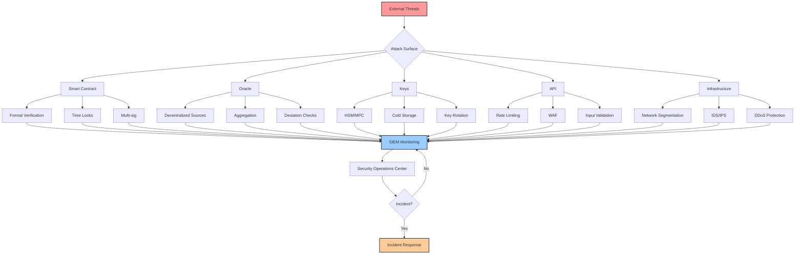
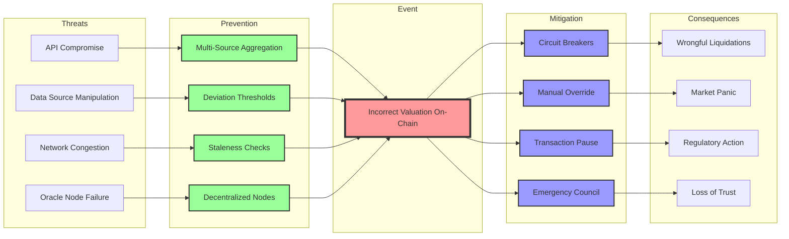
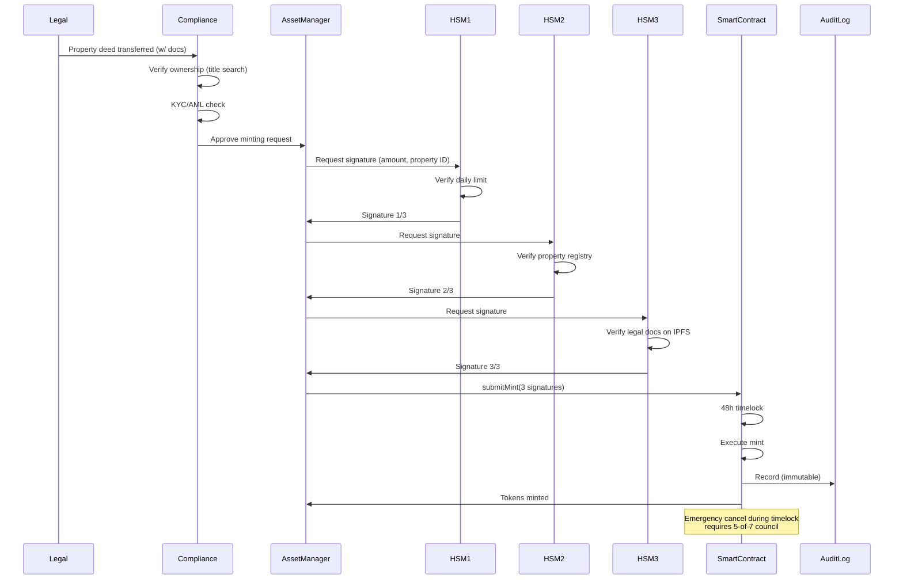
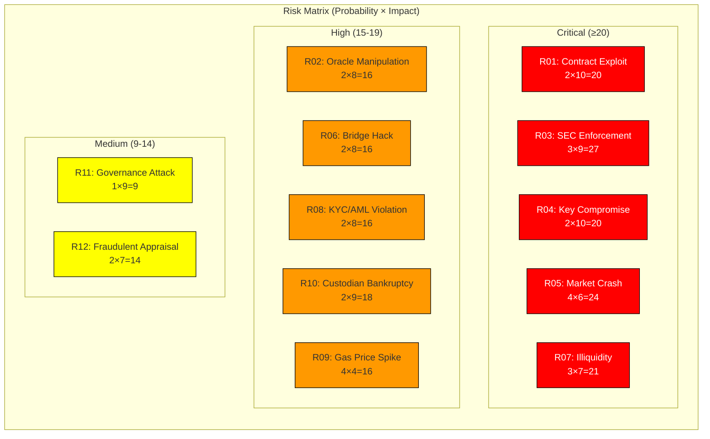
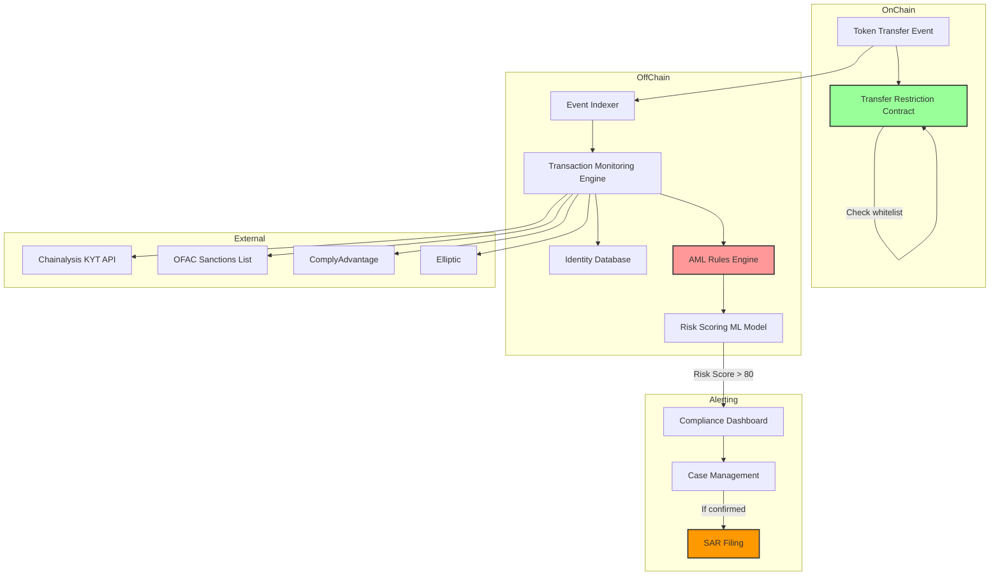
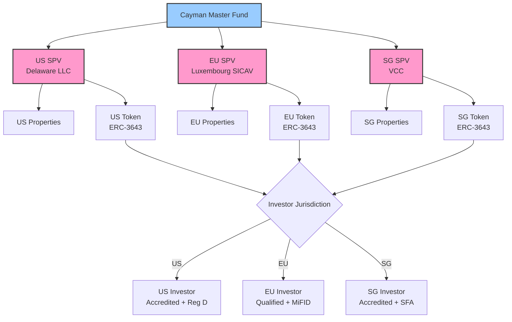
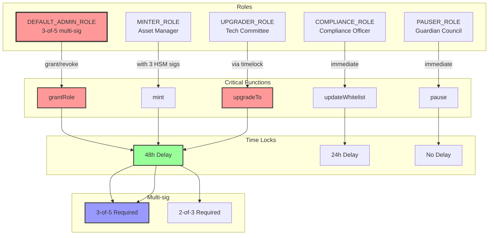
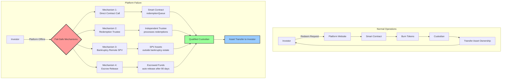
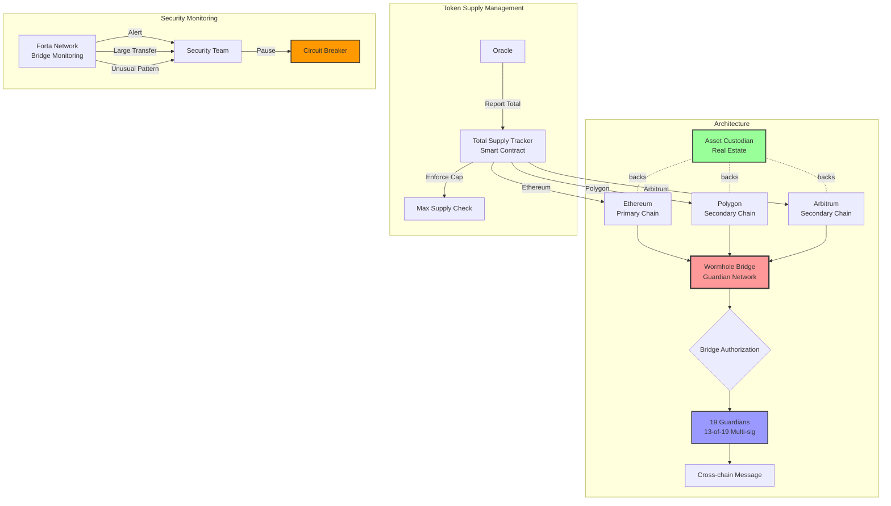
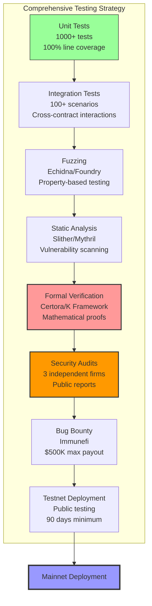

# Blockchain RWA Security Interview Q&A

**Meta**: Last Updated 2025-01-13 | Status: Draft | Owner: Individual

**Context**: Security interview questions for blockchain Real World Asset (RWA) tokenization platforms, covering risk management, smart contract security, regulatory compliance, and operational resilience.

---

## Contents
- [Topic Areas](#topic-areas)
- [Security Assurance](#topic-1-security-assurance)
- [Risk Assessment & Governance](#topic-2-risk-assessment--governance)
- [Prevention & Controls](#topic-3-prevention--controls)
- [Detection & Monitoring](#topic-4-detection--monitoring)
- [Incident Response](#topic-5-incident-response)
- [Compliance & Audit](#topic-6-compliance--audit)
- [References](#references)
- [Validation Results](#validation-results)

---

## Topic Areas

**Coverage Matrix** (Safety/Security/Resilience/Governance × Prevent/Detect/Respond/Recover)

| Dimension | Prevent | Detect | Respond | Recover |
|-----------|---------|---------|---------|---------|
| **Security** | Q1, Q3, Q7, Q10 | Q12, Q13 | Q17, Q18 | Q21 |
| **Safety** | Q2, Q8 | Q14 | Q19 | Q22 |
| **Resilience** | Q9, Q11 | Q15, Q16 | Q20, Q23 | Q24 |
| **Governance** | Q4, Q5, Q6 | Q25, Q26 | Q27 | Q28, Q29, Q30 |

**Total**: 30 Q&As | **Difficulty**: 6F (20%) / 12I (40%) / 12A (40%)

---

## Topic 1: Security Assurance

### Q1: Implement defense-in-depth for an RWA tokenization platform handling real estate assets. Show control layers, threat model, and metrics.

**Difficulty**: Advanced | **Type**: Security | **Phase**: Prevent

**Key Insight**: Defense-in-depth for RWA requires blockchain-specific controls (private key management, oracle security) combined with traditional application security, while maintaining regulatory compliance for securities.

**Answer** (289 words):

Defense-in-depth for RWA tokenization must address both Web3 attack vectors (private key compromise, oracle manipulation, smart contract exploits) and Web2 vulnerabilities (API attacks, infrastructure compromise) [Ref: A1, A2]. Given that RWA tokens represent legal ownership of real-world securities, security failures can trigger both financial loss and regulatory enforcement [Ref: L1].

**Threat Model (STRIDE)**: (1) Spoofing: Unauthorized token minting via compromised admin keys; (2) Tampering: Oracle manipulation to inflate asset valuations; (3) Repudiation: Transaction censorship in Layer 2; (4) Information Disclosure: Exposure of investor PII via on-chain metadata; (5) Denial of Service: Bridge attacks blocking redemptions; (6) Elevation of Privilege: Upgradeability exploits in proxy contracts [Ref: G1, A3].

**Control Architecture**:
1. **Smart Contract Layer**: Formal verification (Certora/K Framework) [Ref: T1], time-locked upgrades (48h), multi-sig admin (3-of-5 hardware wallets), immutable core logic, pausability for emergencies [Ref: A4]
2. **Oracle Layer**: Chainlink decentralized oracles with ≥5 data sources, median aggregation, deviation thresholds (±2%), staleness checks (<1h), fallback to manual feeds [Ref: G2, T2]
3. **Key Management**: HSM-backed custodians (Fireblocks/Copper), MPC wallets for operational keys, cold storage for reserves, key rotation every 90 days [Ref: T3]
4. **Application Layer**: OAuth 2.0 + MFA, rate limiting (100 req/min/user), input validation, CSP headers, API gateway with WAF [Ref: G3]
5. **Infrastructure**: Private subnets, bastion hosts, IDS/IPS, DDoS mitigation (Cloudflare), encrypted backups (AES-256) [Ref: A5]
6. **Compliance**: KYC/AML checks (Chainalysis/Elliptic), transaction monitoring, sanctions screening, audit trails (immutable logs) [Ref: G4, T4]

**Practical Config**:
```yaml
security_layers:
  smart_contract:
    admin_multisig: {threshold: 3, signers: 5, hardware: "Ledger Nano X"}
    timelock: {delay: 172800, cancel_role: "emergency_council"}
    formal_verification: {tool: "Certora", coverage: 100%, critical_invariants: true}
    pause_guardian: {address: "0x...", max_pause: 86400}
  
  oracle:
    provider: "Chainlink"
    data_sources: 7
    aggregation: "median"
    deviation_threshold: 2.0
    heartbeat: 3600
    fallback: {manual: true, delay: 7200, approvals: 2}
  
  key_management:
    operational_keys: {type: "MPC", provider: "Fireblocks", threshold: "2-of-3"}
    treasury_keys: {type: "cold_storage", approvals: 3, location: "multi_jurisdiction"}
    rotation_policy: {frequency: 90, automated: false, audit: true}
  
  monitoring:
    siem: "Splunk"
    alerts:
      - {id: "large_transfer", threshold: 100000, severity: "high", notify: ["security", "compliance"]}
      - {id: "failed_auth", threshold: 5, window: 300, action: "lockout"}
      - {id: "oracle_deviation", threshold: 5.0, severity: "critical", action: "pause"}
  
  compliance:
    kyc_provider: "Chainalysis KYT"
    sanctions_screening: true
    transaction_monitoring: {ml_model: true, risk_scoring: true}
    audit_trail: {immutable: true, retention: 2555, encryption: "AES-256-GCM"}
```

**Threat-Control Mapping**:



**Metrics**:

| Metric | Formula | Target | Rationale [Ref] |
|--------|---------|--------|-----------------|
| Smart Contract Coverage | Verified LOC / Total LOC | 100% critical | Eliminate high-severity bugs [A4] |
| Oracle Uptime | Available Time / Total Time | ≥99.9% | Ensure price feed reliability [G2] |
| Key Rotation Compliance | Rotations / Scheduled | 100% | Limit exposure window [T3] |
| Detection Rate | True Positives / (TP + FN) | ≥95% | SIEM effectiveness [G5] |
| False Positive Rate | FP / (FP + TN) | ≤2% | Prevent alert fatigue [A6] |
| MTTD | Σ(Detection Time) / Incidents | ≤5 min | Minimize exposure [G6] |
| Multi-sig Response Time | Σ(Signature Time) / Transactions | ≤1 hour | Balance security & usability [L2] |

**Trade-offs**:
- **Time locks** (48h) delay urgent fixes but prevent governance attacks; use emergency pause for critical issues [Ref: A7]
- **Multi-sig** (3-of-5) increases security but creates operational friction; operational hot wallets for routine tasks [Ref: L3]
- **Formal verification** is expensive ($50-200K) but eliminates entire vulnerability classes; prioritize critical functions (minting, burning, transfers) [Ref: T1]
- **Decentralized oracles** resist manipulation but cost 5-10× more than centralized; essential for high-value assets [Ref: G2]

**Validation**: 
1. **Security Audit**: 3 independent firms (Trail of Bits, ConsenSys Diligence, OpenZeppelin) with public reports [Ref: A8]
2. **Bug Bounty**: $500K program on Immunefi, critical findings up to $100K [Ref: T5]
3. **Red Team**: Quarterly exercises testing oracle manipulation, key compromise, upgrade exploits [Ref: A9]
4. **Penetration Testing**: Annual infrastructure assessment covering network, API, authentication [Ref: G7]
5. **Compliance Audit**: Annual SOC 2 Type II, regulatory examination by securities regulator [Ref: A10]

---

### Q2: How do you assess and mitigate the risk of oracle failure causing incorrect asset valuation in real estate RWA tokens? Show risk analysis and controls.

**Difficulty**: Intermediate | **Type**: Safety | **Phase**: Prevent

**Key Insight**: Oracle failure in RWA can trigger cascading failures (liquidations, trading halts, loss of investor confidence) requiring multi-layered validation, fallback mechanisms, and circuit breakers.

**Answer** (267 words):

Oracle failure represents both a **safety risk** (incorrect valuations triggering unwarranted liquidations) and **security risk** (manipulation for profit) [Ref: G2, A11]. Real estate RWA tokens depend on off-chain appraisals updated quarterly, making them vulnerable to stale data and manipulation [Ref: L4].

**Risk Analysis** (ISO 31000):
- **Threat**: Oracle reports stale/manipulated property valuation
- **Probability**: Medium (0.2/year) - Historical incidents: Terra/Luna oracle issues (2022), Synthetix oracle attack (2019) [Ref: A12]
- **Impact**: High (8/10) - Incorrect liquidations, market panic, regulatory scrutiny
- **Risk Score**: P × I = 1.6 (Moderate) → **Requires controls**

**Hazard Analysis** (Bow-Tie):



**Controls**:

1. **Prevention (Before Bad Data On-Chain)**:
   - **Multi-source aggregation**: ≥5 independent appraisal firms, median value, discard outliers (>2σ) [Ref: T2]
   - **Staleness checks**: Reject data >7 days old; quarterly mandatory updates [Ref: G8]
   - **Deviation limits**: Flag changes >10% week-over-week for manual review [Ref: A13]
   - **Decentralized infrastructure**: Chainlink with ≥7 nodes across 3 geographies [Ref: T2]

2. **Detection (Bad Data Identified)**:
   - **On-chain validation**: Smart contract checks timestamp, signature, deviation [Ref: A14]
   - **Off-chain monitoring**: Compare oracle price to market indices (NCREIF, Zillow), alert if >5% divergence [Ref: T6]
   - **Anomaly detection**: ML model flags unusual patterns (sudden spikes, consistency across sources) [Ref: G9]

3. **Mitigation (Limit Damage)**:
   - **Circuit breakers**: Pause liquidations if price change >15% in 24h [Ref: A15]
   - **Manual override**: Emergency council can inject corrected valuation with 2-of-3 approval [Ref: L5]
   - **Grace period**: 24h delay before liquidations execute, allowing dispute resolution [Ref: G10]

**Practical Implementation**:

```solidity
contract RWAOracle {
    struct PriceData {
        uint256 value;
        uint256 timestamp;
        uint8 sourceCount;
        bool manualOverride;
    }
    
    uint256 constant MAX_STALENESS = 7 days;
    uint256 constant MAX_DEVIATION_PCT = 10;
    uint256 constant CIRCUIT_BREAKER_PCT = 15;
    
    PriceData public lastPrice;
    address public oracleAggregator;
    address[] public emergencyCouncil;
    
    function updatePrice(PriceData calldata newPrice) external {
        require(msg.sender == oracleAggregator, "Unauthorized");
        require(block.timestamp - newPrice.timestamp < MAX_STALENESS, "Stale data");
        require(newPrice.sourceCount >= 5, "Insufficient sources");
        
        if (lastPrice.value > 0) {
            uint256 deviation = abs(newPrice.value - lastPrice.value) * 100 / lastPrice.value;
            require(deviation <= CIRCUIT_BREAKER_PCT, "Circuit breaker triggered");
            
            if (deviation > MAX_DEVIATION_PCT) {
                emit LargeDeviation(newPrice.value, lastPrice.value, deviation);
            }
        }
        
        lastPrice = newPrice;
        emit PriceUpdated(newPrice.value, newPrice.timestamp);
    }
    
    function emergencyOverride(uint256 correctedValue, bytes[] calldata signatures) external {
        require(signatures.length >= 2, "Insufficient signatures");
        require(verifyCouncilSignatures(correctedValue, signatures), "Invalid signatures");
        
        lastPrice = PriceData({
            value: correctedValue,
            timestamp: block.timestamp,
            sourceCount: 0,
            manualOverride: true
        });
        
        emit EmergencyOverride(correctedValue, msg.sender);
    }
}
```

**Metrics**:

| Metric | Formula | Target | Rationale [Ref] |
|--------|---------|--------|-----------------|
| Oracle Availability | Uptime / Total Time | ≥99.9% | Ensure continuous pricing [T2] |
| Data Freshness | Current Time - Last Update | ≤7 days | Reflect market conditions [G8] |
| Source Diversity | Active Sources / Total | ≥5 sources | Resist manipulation [A11] |
| Deviation Detection | Flagged / Total Updates | 100% if >10% | Catch anomalies [G9] |
| False Circuit Breaker | False Trips / Total | ≤1% | Balance safety & availability [A15] |
| Manual Override Time | Σ(Override Time) / Incidents | ≤2 hours | Emergency responsiveness [L5] |

**Trade-offs**:
- **Decentralized oracles** (Chainlink) cost $500-2000/update vs. $50 for centralized; justify for assets >$10M [Ref: T2]
- **Staleness limits** (7 days) balance data freshness vs. appraisal costs ($1500/property/quarter) [Ref: L4]
- **Circuit breakers** prevent manipulation but may halt legitimate operations; use asymmetric thresholds (15% up, 20% down) [Ref: A15]
- **Manual override** provides emergency response but introduces centralization risk; requires 2-of-3 multi-sig and public disclosure [Ref: G10]

**Validation**:
1. **Oracle stress test**: Inject manipulated data, verify circuit breaker activation and alert generation [Ref: A16]
2. **Historical backtesting**: Replay 2008 housing crisis price drops, validate system behavior [Ref: L6]
3. **Disaster recovery drill**: Simulate Chainlink downtime, test manual override procedures [Ref: G11]

---

### Q3: Design a secure token minting process for commercial real estate RWA that prevents unauthorized minting while maintaining operational efficiency. Include key management and approval workflows.

**Difficulty**: Advanced | **Type**: Security | **Phase**: Prevent

**Key Insight**: Token minting represents the highest-privilege operation in RWA platforms, requiring hardware-backed multi-sig, legal verification workflow, and immutable audit trails to prevent unauthorized token creation that could inflate supply and devalue existing tokens.

**Answer** (284 words):

Unauthorized token minting is catastrophic in RWA—creating tokens without corresponding real assets constitutes securities fraud [Ref: A17]. Unlike DeFi where tokens may be programmatically minted, RWA requires human verification that legal ownership has transferred [Ref: L1, G12].

**Threat Model**:
- **Insider threat**: Rogue employee with access to minting keys (P=0.1/year, I=10, Risk=1.0)
- **Key compromise**: Phishing/malware targeting admin wallets (P=0.2/year, I=10, Risk=2.0)
- **Smart contract exploit**: Bypassing access controls (P=0.05/year, I=10, Risk=0.5)
- **Social engineering**: Manipulating approval workflow (P=0.15/year, I=8, Risk=1.2)

**Total Risk**: 4.7 (High) → **Requires defense-in-depth**

**Control Architecture**:



**Implementation**:

1. **Key Management**:
   - **Hardware Security Modules**: 3 HSMs (Thales Luna, AWS CloudHSM, Ledger Enterprise) in different jurisdictions [Ref: T3]
   - **Segregation**: Minting keys separate from operational keys; cold storage for minting, hot wallets for transfers [Ref: A18]
   - **Threshold**: 3-of-3 multi-sig (higher than 2-of-3 for upgrades due to higher risk) [Ref: L7]
   - **Key ceremony**: Initial setup with witnesses, recorded, keys never consolidated [Ref: G13]

2. **Approval Workflow**:
   - **Legal verification**: Title company confirms deed transfer, uploads to IPFS, hash on-chain [Ref: T7]
   - **Compliance review**: AML screening (Chainalysis), sanctions check (OFAC), accredited investor verification [Ref: T4]
   - **Dual authorization**: Legal + compliance both approve before asset manager initiates [Ref: A19]
   - **Document trail**: All approvals signed with YubiKeys, stored in immutable log [Ref: G14]

3. **Smart Contract Controls**:
   - **Role-based access**: OpenZeppelin AccessControl, separate MINTER_ROLE [Ref: T8]
   - **Time lock**: 48h delay between submission and execution, allows emergency cancel [Ref: A7]
   - **Supply tracking**: On-chain mapping of propertyID → tokenSupply, enforces 1:1 backing [Ref: A20]
   - **Daily limits**: Max 10M tokens/day to rate-limit compromise impact [Ref: G15]

**Practical Config**:

```yaml
minting_workflow:
  key_management:
    hsm_providers: ["Thales Luna", "AWS CloudHSM", "Ledger Enterprise"]
    threshold: {required: 3, total: 3}
    key_type: "ECDSA secp256k1"
    rotation: {frequency: 180, requires_legal: true}
    backup: {encrypted: true, multi_jurisdiction: true, split: "Shamir 5-of-7"}
  
  approval_stages:
    - stage: "legal_verification"
      role: "legal_counsel"
      checks: ["title_search", "deed_transfer", "encumbrance_check"]
      document_upload: "IPFS"
      signature: "YubiKey"
      
    - stage: "compliance_review"
      role: "compliance_officer"
      checks: ["aml_screening", "sanctions_check", "accredited_investor"]
      tools: ["Chainalysis KYT", "ComplyAdvantage"]
      risk_scoring: true
      
    - stage: "asset_manager_initiate"
      role: "asset_manager"
      requires_approvals: ["legal", "compliance"]
      daily_limit: {amount: 10000000, reset: "00:00 UTC"}
      
  smart_contract:
    timelock_delay: 172800
    emergency_cancel: {threshold: 5, signers: 7, role: "guardian_council"}
    supply_validation: {enforce_backing: true, oracle_verify: true}
    
  audit:
    logging: {destination: "Arweave", encryption: "AES-256-GCM"}
    retention: "perpetual"
    attestation: {frequency: "quarterly", auditor: "Big 4 firm"}
```

**Smart Contract Implementation**:

```solidity
contract RWAMinter is AccessControl, TimelockController {
    bytes32 public constant MINTER_ROLE = keccak256("MINTER_ROLE");
    bytes32 public constant GUARDIAN_ROLE = keccak256("GUARDIAN_ROLE");
    
    uint256 public constant DAILY_MINT_LIMIT = 10_000_000 * 10**18;
    uint256 public constant TIMELOCK_DELAY = 48 hours;
    
    struct MintRequest {
        address recipient;
        uint256 amount;
        bytes32 propertyId;
        bytes32 legalDocHash;
        bytes32 complianceDocHash;
        uint256 timestamp;
        bool executed;
        bool cancelled;
    }
    
    mapping(uint256 => MintRequest) public mintRequests;
    mapping(bytes32 => uint256) public propertySupply;
    mapping(uint256 => uint256) public dailyMinted;
    
    uint256 public nextRequestId;
    IRWAToken public token;
    
    event MintRequested(uint256 indexed requestId, bytes32 indexed propertyId, uint256 amount);
    event MintExecuted(uint256 indexed requestId, address recipient, uint256 amount);
    event MintCancelled(uint256 indexed requestId, address canceller);
    
    function requestMint(
        address recipient,
        uint256 amount,
        bytes32 propertyId,
        bytes32 legalDocHash,
        bytes32 complianceDocHash,
        bytes[3] calldata signatures
    ) external onlyRole(MINTER_ROLE) returns (uint256) {
        uint256 today = block.timestamp / 1 days;
        require(dailyMinted[today] + amount <= DAILY_MINT_LIMIT, "Daily limit exceeded");
        
        require(verifyMultisig(propertyId, amount, signatures), "Invalid signatures");
        
        require(verifyLegalDoc(legalDocHash), "Legal verification failed");
        require(verifyComplianceDoc(complianceDocHash), "Compliance verification failed");
        
        uint256 requestId = nextRequestId++;
        mintRequests[requestId] = MintRequest({
            recipient: recipient,
            amount: amount,
            propertyId: propertyId,
            legalDocHash: legalDocHash,
            complianceDocHash: complianceDocHash,
            timestamp: block.timestamp,
            executed: false,
            cancelled: false
        });
        
        dailyMinted[today] += amount;
        
        emit MintRequested(requestId, propertyId, amount);
        return requestId;
    }
    
    function executeMint(uint256 requestId) external {
        MintRequest storage request = mintRequests[requestId];
        require(!request.executed, "Already executed");
        require(!request.cancelled, "Request cancelled");
        require(block.timestamp >= request.timestamp + TIMELOCK_DELAY, "Timelock active");
        
        request.executed = true;
        propertySupply[request.propertyId] += request.amount;
        
        token.mint(request.recipient, request.amount);
        
        emit MintExecuted(requestId, request.recipient, request.amount);
    }
    
    function emergencyCancel(uint256 requestId, bytes[] calldata guardianSignatures) external {
        require(guardianSignatures.length >= 5, "Need 5 guardian signatures");
        require(verifyGuardianSignatures(requestId, guardianSignatures), "Invalid guardian signatures");
        
        MintRequest storage request = mintRequests[requestId];
        require(!request.executed, "Already executed");
        require(!request.cancelled, "Already cancelled");
        
        request.cancelled = true;
        uint256 today = request.timestamp / 1 days;
        dailyMinted[today] -= request.amount;
        
        emit MintCancelled(requestId, msg.sender);
    }
    
    function verifyMultisig(bytes32 propertyId, uint256 amount, bytes[3] calldata signatures) internal view returns (bool) {
        bytes32 messageHash = keccak256(abi.encodePacked(propertyId, amount, block.timestamp / 1 hours));
        bytes32 ethSignedHash = messageHash.toEthSignedMessageHash();
        
        address[3] memory signers;
        for (uint i = 0; i < 3; i++) {
            signers[i] = ethSignedHash.recover(signatures[i]);
        }
        
        return (
            hasRole(MINTER_ROLE, signers[0]) &&
            hasRole(MINTER_ROLE, signers[1]) &&
            hasRole(MINTER_ROLE, signers[2]) &&
            signers[0] != signers[1] &&
            signers[1] != signers[2] &&
            signers[0] != signers[2]
        );
    }
}
```

**Metrics**:

| Metric | Formula | Target | Rationale [Ref] |
|--------|---------|--------|-----------------|
| Multi-sig Coverage | Multi-sig Mints / Total Mints | 100% | No single point of failure [L7] |
| Timelock Compliance | Delayed Mints / Total Mints | 100% | Allow cancellation window [A7] |
| Document Verification | Verified / Total Requests | 100% | Legal compliance [A17] |
| Key Rotation Compliance | Rotations / Scheduled | 100% | Limit exposure [T3] |
| Unauthorized Mint Attempts | Blocked / Total Attempts | 100% | Access control effectiveness [T8] |
| Emergency Cancel Time | Σ(Cancel Time) / Incidents | ≤1 hour | Guardian responsiveness [G13] |
| Audit Trail Completeness | Logged Events / Total Events | 100% | Forensic capability [G14] |

**Trade-offs**:
- **3-of-3 multi-sig** provides maximum security but creates operational bottleneck; if one HSM fails, minting halts (mitigate: backup key ceremony procedures) [Ref: L7]
- **48h timelock** allows fraud detection but delays legitimate minting; asymmetric for emergency burns (1h delay) [Ref: A7]
- **Daily limits** (10M) constrain attack impact but may block large legitimate transactions; implement governance override for institutional deals [Ref: G15]
- **Perpetual audit logs** on Arweave cost $5-10K/year but provide immutable evidence for regulators [Ref: T7]

**Validation**:
1. **Penetration test**: Red team attempts to mint without approvals, bypassing multi-sig, exploiting smart contract [Ref: A9]
2. **Key ceremony audit**: Independent observer verifies setup, segregation, backup procedures [Ref: G13]
3. **Workflow audit**: Trace 100% of mints to legal documents, verify compliance checks [Ref: A19]
4. **Disaster recovery**: Simulate HSM failure, test backup key recovery (target: mint restoration <24h) [Ref: L8]

---

## Topic 2: Risk Assessment & Governance

### Q4: Perform a comprehensive risk assessment for a real estate RWA platform covering smart contract, operational, regulatory, and market risks. Prioritize using a risk matrix and propose mitigations.

**Difficulty**: Intermediate | **Type**: Governance | **Phase**: Prevent

**Key Insight**: RWA risk assessment must integrate traditional financial risk (market, credit, liquidity) with Web3-specific risks (smart contract, oracle, bridge), while addressing regulatory uncertainty unique to tokenized securities.

**Answer** (295 words):

RWA risk assessment requires multi-dimensional analysis beyond traditional IT risk frameworks due to (1) immutable smart contracts amplifying code risks, (2) regulatory ambiguity around securities tokenization, (3) novel bridge/oracle attack vectors [Ref: L1, A21]. Applying ISO 31000 risk management to blockchain requires blockchain-specific threat modeling [Ref: G16, A22].

**Risk Identification** (MECE Categories):

1. **Smart Contract Risks**: Reentrancy, integer overflow, access control bypass, upgradeability exploits, front-running [Ref: A3]
2. **Operational Risks**: Key loss, insider fraud, HSM failure, oracle downtime, governance attacks [Ref: G17]
3. **Regulatory Risks**: Unregistered securities violation, KYC/AML non-compliance, cross-jurisdiction conflicts, sudden regulation changes [Ref: A23]
4. **Market Risks**: Illiquidity (RWA tokens trade thin), valuation uncertainty (appraisal lag), macroeconomic shocks (interest rate spikes) [Ref: L9]
5. **Technology Risks**: Network congestion (high gas fees blocking redemptions), bridge hacks, Layer 2 centralization, protocol upgrades breaking compatibility [Ref: A24]
6. **Legal Risks**: Property liens discovered post-tokenization, bankruptcy of asset custodian, token holder rights enforcement [Ref: L10]

**Risk Analysis (Probability × Impact)**:

| Risk ID | Risk Event | Category | Probability (1-5) | Impact (1-10) | Risk Score | Priority |
|---------|------------|----------|-------------------|---------------|------------|----------|
| R01 | Smart contract exploit steals treasury | Technical | 2 | 10 | 20 | Critical |
| R02 | Oracle manipulation inflates valuation | Technical | 2 | 8 | 16 | High |
| R03 | SEC determines tokens are unregistered securities | Regulatory | 3 | 9 | 27 | Critical |
| R04 | Private key compromise enables unauthorized minting | Operational | 2 | 10 | 20 | Critical |
| R05 | Property market crash reduces collateral value | Market | 4 | 6 | 24 | High |
| R06 | Bridge hack drains cross-chain liquidity | Technical | 2 | 8 | 16 | High |
| R07 | Insufficient liquidity prevents token redemptions | Market | 3 | 7 | 21 | High |
| R08 | KYC/AML violation triggers regulatory enforcement | Regulatory | 2 | 8 | 16 | High |
| R09 | Gas price spike makes small transfers uneconomical | Technical | 4 | 4 | 16 | Medium |
| R10 | Bankruptcy of custodian freezes underlying assets | Legal | 2 | 9 | 18 | High |
| R11 | Governance attack changes critical parameters | Operational | 1 | 9 | 9 | Medium |
| R12 | Appraisal firm provides fraudulent valuation | Operational | 2 | 7 | 14 | Medium |

**Risk Matrix**:



**Risk Treatment** (Priority Order):

**Critical Risks (Address Immediately)**:

1. **R03 - SEC Enforcement**: 
   - **Mitigation**: Reg D 506(c) exemption, accredited investor gating, transfer restrictions, legal opinion [Ref: A25]
   - **Residual Risk**: 1×9=9 (Medium) after Regulation A+ qualification

2. **R01 - Smart Contract Exploit**:
   - **Mitigation**: 3 independent audits, formal verification, bug bounty, immutable core logic, upgradeable peripherals only [Ref: A4]
   - **Residual Risk**: 1×10=10 (Medium) with insurance coverage

3. **R04 - Key Compromise**:
   - **Mitigation**: HSM-backed 3-of-3 multi-sig, cold storage, key rotation every 180 days, insider threat monitoring [Ref: T3]
   - **Residual Risk**: 1×10=10 (Medium) with key compromise insurance

4. **R05 - Market Crash**:
   - **Mitigation**: Geographic diversification (10+ states), property type diversification (office/retail/industrial), conservative LTV (≤70%), stress testing [Ref: L9]
   - **Transfer**: Subordinated debt layer absorbs first 20% loss
   - **Residual Risk**: 4×3=12 (Medium)

5. **R07 - Illiquidity**:
   - **Mitigation**: Liquidity pool with 10% reserve, market maker agreement, redemption queue, periodic auction mechanism [Ref: A26]
   - **Residual Risk**: 2×7=14 (Medium)

**High Risks (Address in 90 Days)**:

6. **R02 - Oracle Manipulation**: Chainlink with 7 nodes, median aggregation, circuit breakers [Ref: T2]
7. **R06 - Bridge Hack**: Avoid bridges; native issuance on each chain or trusted bridge (Wormhole with Guardian network) [Ref: A27]
8. **R08 - KYC/AML Violation**: Chainalysis KYT, transaction monitoring, sanctions screening [Ref: T4]
9. **R10 - Custodian Bankruptcy**: Qualified custodian (SEC registered), bankruptcy-remote SPV, tri-party custody [Ref: L11]

**Control Mapping**:

```yaml
risk_controls:
  R01_contract_exploit:
    preventive:
      - formal_verification: {tool: "Certora", coverage: "100% critical functions"}
      - audit: {firms: 3, public_report: true}
      - immutability: {core_logic: true, upgradeability: "peripherals only"}
    detective:
      - monitoring: {tool: "Forta", alerts: "suspicious transactions"}
      - bug_bounty: {platform: "Immunefi", max_payout: 100000}
    corrective:
      - pause_mechanism: {guardian: true, max_duration: "48h"}
      - insurance: {coverage: 10000000, provider: "Nexus Mutual"}
    
  R03_sec_enforcement:
    preventive:
      - legal_structure: {exemption: "Reg D 506(c)", accredited_only: true}
      - transfer_restrictions: {holding_period: 365, whitelist: true}
      - legal_opinion: {frequency: "annual", firm: "top_tier"}
    detective:
      - compliance_monitoring: {kyc: true, ongoing: true}
      - regulatory_tracking: {alerts: true, law_firm: true}
    corrective:
      - remediation_plan: {prepared: true, external_counsel: true}
  
  R04_key_compromise:
    preventive:
      - hsm: {providers: 3, threshold: "3-of-3"}
      - cold_storage: {minting_keys: true, multi_jurisdiction: true}
      - key_rotation: {frequency: 180, ceremony: true}
      - access_control: {mfa: true, ip_whitelist: true, hardware_token: true}
    detective:
      - monitoring: {unusual_access: true, failed_attempts: true}
      - audit_trail: {immutable: true, real_time_alerting: true}
    corrective:
      - revocation: {immediate: true, backup_keys: true}
      - insurance: {key_compromise_coverage: 5000000}
  
  R05_market_crash:
    preventive:
      - diversification: {geographic: 10, property_types: 4}
      - conservative_ltv: {max: 70, appraisal: "quarterly"}
      - stress_testing: {scenarios: ["2008 crisis", "COVID crash"], frequency: "quarterly"}
    detective:
      - monitoring: {oracle_price: true, market_indices: true}
      - risk_reporting: {dashboard: true, frequency: "weekly"}
    corrective:
      - subordinated_debt: {first_loss: "20%"}
      - liquidity_reserve: {percentage: 10, liquid_assets: true}
  
  R07_illiquidity:
    preventive:
      - liquidity_pool: {reserve: "10%", assets: "stablecoins"}
      - market_maker: {agreement: true, spread: "max 2%"}
    detective:
      - monitoring: {volume: true, spread: true, depth: true}
    corrective:
      - redemption_queue: {max_delay: 90}
      - auction_mechanism: {periodic: true, frequency: "quarterly"}
```

**Metrics**:

| Metric | Formula | Target | Rationale [Ref] |
|--------|---------|--------|-----------------|
| Risk Coverage | Controlled Risks / Total Risks | 100% | Comprehensive mitigation [G16] |
| Critical Risk Reduction | (Initial - Residual) / Initial | ≥50% | Effectiveness [A22] |
| Control Effectiveness | Incidents Prevented / Incidents Attempted | ≥80% | Validate controls [L12] |
| Residual Risk Acceptability | Residual Score | ≤15 | Risk appetite [G18] |
| Risk Review Frequency | Reviews / Year | ≥4 | Dynamic environment [A21] |
| Insurance Coverage | Coverage / Potential Loss | ≥80% | Transfer high-impact risks [A28] |

**Trade-offs**:
- **Risk transfer via insurance** costs 2-5% of coverage annually but essential for existential risks (contract exploit, key compromise) [Ref: A28]
- **Conservative LTV** (70% vs 90%) reduces yield but provides cushion for market downturns [Ref: L9]
- **Formal verification** costs $100-300K but mathematically proves correctness for critical functions [Ref: T1]
- **Accredited investor restriction** reduces market size but simplifies regulatory compliance [Ref: A25]

**Validation**:
1. **Risk workshop**: Quarterly sessions with technical, legal, compliance, and operations teams [Ref: G16]
2. **Scenario analysis**: Simulate each critical risk, test control effectiveness [Ref: L12]
3. **Board reporting**: Risk dashboard reviewed monthly, risk appetite reviewed annually [Ref: A29]
4. **Independent review**: External risk assessment by Big 4 firm annually [Ref: G19]

---


### Q5: Design a compliance monitoring system for RWA tokens that ensures ongoing KYC/AML compliance, transaction monitoring, and sanctions screening. Show architecture and detection rules.

**Difficulty**: Intermediate | **Type**: Governance | **Phase**: Prevent

**Key Insight**: Unlike DeFi's permissionless nature, RWA tokens representing securities require continuous compliance monitoring to detect suspicious patterns, sanctioned addresses, and regulatory violations, balancing on-chain transparency with off-chain privacy requirements.

**Answer** (278 words):

RWA compliance is more stringent than traditional securities because (1) 24/7 global trading vs exchange hours, (2) pseudonymous addresses requiring on-chain identity linking, (3) instant settlement vs T+2 [Ref: A30, L13]. SEC/FINRA expect equivalent controls to traditional broker-dealers [Ref: A31].

**Architecture**:



**Components**:

1. **Transfer Restrictions (On-Chain)**:
   - **Whitelist enforcement**: Only KYC-verified addresses can hold tokens [Ref: T9]
   - **Jurisdictional blocks**: Prevent transfers to sanctioned countries (IP + address registry) [Ref: A32]
   - **Holding period locks**: Enforce Reg D 12-month holding period [Ref: A25]
   - **Accredited investor gates**: Verify accreditation status before allowing purchase [Ref: G20]

```solidity
contract ComplianceRWAToken is ERC20 {
    mapping(address => bool) public whitelist;
    mapping(address => uint256) public accreditationExpiry;
    mapping(address => mapping(uint256 => uint256)) public acquisitionTime; // tokenId => timestamp
    
    uint256 constant HOLDING_PERIOD = 365 days;
    
    IIdentityRegistry public identityRegistry;
    ISanctionsList public sanctionsList;
    
    function transfer(address to, uint256 amount) public override returns (bool) {
        require(whitelist[msg.sender], "Sender not whitelisted");
        require(whitelist[to], "Recipient not whitelisted");
        require(!sanctionsList.isSanctioned(to), "Recipient sanctioned");
        require(accreditationExpiry[to] > block.timestamp, "Recipient accreditation expired");
        require(canTransfer(msg.sender, amount), "Holding period not met");
        
        uint256 country = identityRegistry.getCountry(to);
        require(!isRestrictedJurisdiction(country), "Restricted jurisdiction");
        
        emit TransferAttempt(msg.sender, to, amount, true);
        return super.transfer(to, amount);
    }
    
    function canTransfer(address holder, uint256 amount) public view returns (bool) {
        uint256 transferable = 0;
        for (uint256 i = 0; i < balanceOf(holder); i++) {
            if (block.timestamp >= acquisitionTime[holder][i] + HOLDING_PERIOD) {
                transferable += 1;
            }
        }
        return transferable >= amount;
    }
}
```

2. **Transaction Monitoring (Off-Chain)**:
   - **Pattern detection**: Structuring (many small transfers to avoid $10K threshold), layering, unusual velocity [Ref: G21]
   - **Risk scoring**: ML model assigns 0-100 risk score based on counterparty history, amount, frequency [Ref: T10]
   - **Real-time screening**: Chainalysis KYT checks every transaction against known illicit addresses [Ref: T4]
   - **OFAC matching**: Instant check against SDN list, block transaction if match [Ref: A33]

**Detection Rules**:

```yaml
aml_rules:
  - rule_id: "R001_structuring"
    name: "Potential Structuring"
    description: "Multiple transfers just below $10K reporting threshold"
    conditions:
      - count: {transfers_24h: {min: 5}}
      - amount: {per_transfer: {min: 9000, max: 9999}}
      - sender: {same: true}
    severity: "high"
    action: ["alert", "hold_pending_review"]
    
  - rule_id: "R002_rapid_movement"
    name: "Rapid Funds Movement"
    description: "Tokens transferred through multiple addresses quickly"
    conditions:
      - hops: {count: {min: 3}, timeframe: 3600}
      - final_destination: {new_address: true, no_kyc: true}
    severity: "high"
    action: ["alert", "freeze_destination"]
    
  - rule_id: "R003_high_risk_jurisdiction"
    name: "High Risk Jurisdiction Transfer"
    description: "Transfer to/from FATF blacklist country"
    conditions:
      - jurisdiction: {list: ["FATF_blacklist", "FATF_greylist"]}
    severity: "critical"
    action: ["block", "alert", "sar_consideration"]
    
  - rule_id: "R004_sanctioned_entity"
    name: "Sanctioned Entity Interaction"
    description: "Transaction involving OFAC SDN address"
    conditions:
      - address: {on_list: "OFAC_SDN"}
    severity: "critical"
    action: ["block", "alert", "legal_review", "freeze_all"]
    
  - rule_id: "R005_unusual_volume"
    name: "Unusual Volume for User"
    description: "Transfer amount >5x user's historical average"
    conditions:
      - amount: {vs_historical_avg: {multiplier: 5}}
      - user_tenure: {min_days: 30}
    severity: "medium"
    action: ["alert", "manual_review"]
    
  - rule_id: "R006_mixer_interaction"
    name: "Tornado Cash/Mixer Use"
    description: "Funds originated from known mixer"
    conditions:
      - source_analysis: {mixer_detected: true, hops_back: 5}
    severity: "high"
    action: ["alert", "enhanced_due_diligence", "sar_consideration"]
    
  - rule_id: "R007_pep_transaction"
    name: "Politically Exposed Person"
    description: "Transaction involving PEP requires enhanced monitoring"
    conditions:
      - identity: {pep_status: true}
      - amount: {min: 50000}
    severity: "medium"
    action: ["alert", "enhanced_monitoring", "document_source_of_funds"]
    
  - rule_id: "R008_expired_accreditation"
    name: "Expired Accreditation"
    description: "User accreditation expired, pending renewal"
    conditions:
      - accreditation: {expired: true}
      - action_type: "purchase"
    severity: "medium"
    action: ["block", "notify_user", "request_renewal"]

risk_scoring:
  factors:
    - name: "counterparty_history"
      weight: 0.25
      calculation: "clean_transactions / total_transactions"
      
    - name: "jurisdictional_risk"
      weight: 0.20
      tiers:
        low: ["US", "UK", "EU", "SG", "JP"]
        medium: ["BR", "IN", "ZA"]
        high: ["FATF_greylist"]
        critical: ["FATF_blacklist", "OFAC_sanctioned"]
        
    - name: "transaction_velocity"
      weight: 0.15
      calculation: "transfers_7d / avg_transfers_30d"
      thresholds: {normal: "<2", elevated: "2-5", suspicious: ">5"}
      
    - name: "source_of_funds"
      weight: 0.15
      checks: ["mixer_exposure", "exchange_direct", "known_illicit"]
      
    - name: "amount_relative"
      weight: 0.10
      calculation: "transfer_amount / user_net_worth"
      thresholds: {normal: "<0.1", elevated: "0.1-0.5", suspicious: ">0.5"}
      
    - name: "user_tenure"
      weight: 0.10
      calculation: "days_since_kyc"
      bonus: "+10 if >365, +5 if >180"
      
    - name: "identity_verification_level"
      weight: 0.05
      tiers: {basic: 0, intermediate: 5, advanced: 10, institutional: 15}
  
  thresholds:
    low: {max: 30, action: "auto_approve"}
    medium: {min: 31, max: 60, action: "alert_only"}
    high: {min: 61, max: 80, action: "manual_review"}
    critical: {min: 81, action: "hold_and_escalate"}

monitoring_metrics:
  - metric: "alerts_per_day"
    target: {min: 5, max: 50}
    rationale: "Too few = rules too lenient; too many = alert fatigue"
    
  - metric: "false_positive_rate"
    target: {max: 0.10}
    calculation: "dismissed_alerts / total_alerts"
    
  - metric: "sar_filing_rate"
    target: {industry_benchmark: 0.02}
    calculation: "sars_filed / total_users"
    
  - metric: "average_review_time"
    target: {max: 3600}
    measurement: "seconds from alert to resolution"
    
  - metric: "sanctions_match_accuracy"
    target: {min: 0.99}
    calculation: "true_matches / (true_matches + false_matches)"
```

3. **Identity Linking**:
   - **KYC database**: Off-chain database mapping addresses to verified identities [Ref: G22]
   - **Multi-wallet tracking**: Graph analysis to link addresses controlled by same entity [Ref: T11]
   - **Attestations**: On-chain commitments (hashes) to off-chain KYC data [Ref: A34]

4. **Case Management**:
   - **Alert triage**: Compliance officers review high-risk transactions within 1 hour [Ref: G23]
   - **Enhanced due diligence**: Request source of funds documentation for suspicious activity [Ref: A35]
   - **SAR filing**: Suspicious Activity Reports filed with FinCEN within 30 days [Ref: A36]
   - **Audit trail**: All decisions logged with rationale for regulatory exams [Ref: G14]

**Metrics**:

| Metric | Formula | Target | Rationale [Ref] |
|--------|---------|--------|-----------------|
| Whitelist Coverage | Whitelisted Addresses / Total Holders | 100% | Regulatory compliance [T9] |
| Sanctions Screening Coverage | Screened Txs / Total Txs | 100% | OFAC compliance [A33] |
| False Positive Rate | Dismissed Alerts / Total Alerts | ≤10% | Operational efficiency [G23] |
| Alert Response Time | Σ(Response Time) / Alerts | ≤1 hour | Timely intervention [A35] |
| SAR Filing Timeliness | On-time SARs / Total SARs | 100% | Regulatory requirement [A36] |
| Transaction Monitoring Coverage | Monitored Value / Total Value | 100% | Comprehensive surveillance [L13] |

**Trade-offs**:
- **On-chain restrictions** provide transparency but reveal compliance logic to adversaries; use off-chain screening for sophisticated rules [Ref: A34]
- **Real-time blocking** prevents violations but may false-positive legitimate users; implement rapid appeal process [Ref: G23]
- **ML risk scoring** improves detection but lacks explainability for SAR filing; maintain rule-based layer [Ref: T10]
- **Continuous monitoring** costs $50-100K/year (Chainalysis, staff) but essential for regulatory compliance [Ref: T4]

**Validation**:
1. **Audit testing**: Regulatory examiner tests sanctions list coverage, SAR filing procedures [Ref: A31]
2. **Red team**: Attempt to bypass whitelist, structure transactions, use mixers [Ref: A9]
3. **Metrics review**: Monthly analysis of alert volumes, false positive rates, response times [Ref: G23]

---

### Q6: Develop a regulatory compliance strategy for a cross-border real estate RWA platform operating in US, EU, and Singapore. Address securities registration, tax reporting, and data privacy requirements.

**Difficulty**: Advanced | **Type**: Governance | **Phase**: Prevent

**Key Insight**: Cross-border RWA requires navigating conflicting securities regulations (SEC vs MiFID II vs MAS), tax withholding regimes (FATCA, CRS), and data privacy laws (GDPR, CCPA), often requiring jurisdiction-specific token contracts and operational entities.

**Answer** (298 words):

Cross-border RWA is exceptionally complex because securities laws lack harmonization—tokens legal in one jurisdiction may be unregistered securities in another [Ref: A37, L14]. Unlike software (global deployment), RWA requires legal/compliance infrastructure in each jurisdiction [Ref: A38].

**Jurisdictional Analysis**:

| Jurisdiction | Securities Framework | Registration Path | Investor Restrictions | Tax Reporting | Data Privacy |
|--------------|---------------------|-------------------|----------------------|---------------|--------------|
| **United States** | Securities Act 1933 | Reg D 506(c) exemption | Accredited investors only | Form 1099, FATCA | CCPA (California) |
| **European Union** | MiFID II, Prospectus Regulation | Prospectus exemption (<€8M) | Qualified investors (MiFID) | DAC6, CRS | GDPR (strict) |
| **Singapore** | Securities & Futures Act | Small offer exemption | Accredited/institutional | IRAS reporting, CRS | PDPA |
| **Conflicts** | Different definitions of "security" | Different exemption criteria | Different investor qualifications | Different withholding rates | Different data retention rules |

**Strategic Approach**:

1. **Multi-Entity Structure**:
   - **US SPV**: Holds US properties, issues US tokens under Reg D, US tax ID [Ref: A39]
   - **EU SPV**: Holds EU properties, issues EU tokens under Prospectus exemption, AIFMD compliance [Ref: A40]
   - **SG SPV**: Holds SG properties, issues SG tokens under Small Offers exemption [Ref: A41]
   - **Cayman Master Fund**: Aggregates returns, handles cross-border allocations [Ref: L15]



2. **Securities Compliance**:

**United States (SEC)**:
- **Registration exemption**: Reg D Rule 506(c) - accredited investors only, verified via third party (e.g., CPA letter) [Ref: A25]
- **Form D filing**: Within 15 days of first sale in each state [Ref: A42]
- **Transfer restrictions**: 12-month holding period, legend on tokens, transfer agent controls [Ref: G24]
- **Ongoing reporting**: Not required for 506(c), but provide annual audited financials to maintain investor confidence [Ref: A43]
- **Broker-dealer considerations**: If platform facilitates secondary trading, may need BD registration or use registered BD/ATS [Ref: A44]

**European Union (ESMA)**:
- **Prospectus exemption**: If total offering <€8M per 12 months, exempt from prospectus requirement under Prospectus Regulation Article 1(3) [Ref: A40]
- **MiFID II compliance**: If operating trading venue, need authorization or use third-party MTF/OTF [Ref: A45]
- **AIFMD considerations**: SPV may be Alternative Investment Fund requiring AIFM or using external AIFM [Ref: L16]
- **Qualified investor verification**: Satisfy MiFID II Annex II criteria (€500K portfolio or professional) [Ref: A46]

**Singapore (MAS)**:
- **Small Offers exemption**: If offering <SGD 5M in 12 months to <50 investors, exempt from prospectus [Ref: A41]
- **Accredited investor verification**: SGD 2M financial assets or SGD 300K income [Ref: A47]
- **VCC structure**: Variable Capital Company for funds, allows multiple sub-funds [Ref: L17]
- **Digital token framework**: Payment Services Act regulates issuers; obtain license or exemption [Ref: A48]

3. **Tax Compliance**:

```yaml
tax_compliance:
  united_states:
    reporting:
      - form_1099_div: {trigger: "dividends > $10", deadline: "Jan 31"}
      - form_1099_b: {trigger: "token sales", deadline: "Jan 31"}
      - fatca: {threshold: "$50K account", report_to: "IRS"}
    withholding:
      - foreign_investors: {rate: "30%", treaty_relief: "W-8BEN"}
      - backup_withholding: {rate: "24%", trigger: "missing TIN"}
    structure:
      - entity: "Delaware LLC"
      - tax_treatment: "pass-through to investors"
      - k1_issuance: true
  
  european_union:
    reporting:
      - dac6: {scope: "cross-border tax arrangements", report_to: "local tax authority"}
      - crs: {scope: "financial accounts", report_to: "local tax authority"}
    withholding:
      - dividend_tax: {rate: "varies by country", 0-35%}
      - treaty_relief: {available: true, requires: "residence certificate"}
    structure:
      - entity: "Luxembourg SICAV"
      - tax_treatment: "corporate tax but treaty benefits"
      - gdpr_compliant_storage: true
  
  singapore:
    reporting:
      - iras: {deadline: "Nov 30 after tax year", form: "C-S"}
      - crs: {scope: "reportable accounts", report_to: "IRAS"}
    withholding:
      - dividend_tax: {rate: "0%", reason: "one-tier corporate tax system"}
      - foreign_investors: {withholding: "varies by treaty"}
    structure:
      - entity: "VCC"
      - tax_treatment: "corporate tax 17%, but exemptions for funds"
      - approved_fund_status: {benefit: "tax exempt on specified income"}

data_localization:
  gdpr_eu:
    requirements:
      - legal_basis: "contract performance + legitimate interest"
      - data_minimization: "only KYC data necessary for compliance"
      - storage_location: "EEA or adequate country"
      - retention: "5 years post-relationship for AML, then delete"
      - rights: "access, rectification, erasure, portability"
    implementation:
      - kyc_data: {storage: "AWS Frankfurt", encryption: "AES-256-GCM"}
      - blockchain_data: {public: "hash only", private: "off-chain with access control"}
      - dpa: {required: true, vendor: "all service providers"}
      - dpo: {appointed: true, independent: true}
  
  ccpa_california:
    requirements:
      - disclosure: "categories collected, purposes, third parties"
      - opt_out: "right to opt out of sales (not applicable)"
      - deletion: "right to delete (conflict with AML retention)"
    implementation:
      - privacy_notice: {url: "/privacy", updated: "annually"}
      - request_portal: {available: true, respond: "45 days"}
      - exemptions: {b2b: true, aml_override: true}
  
  pdpa_singapore:
    requirements:
      - consent: "explicit for collection and use"
      - purpose_limitation: "only for stated purposes"
      - retention: "only as long as needed (conflict with AML)"
      - transfer: "consent for cross-border transfers"
    implementation:
      - consent_management: {platform: "OneTrust", granular: true}
      - data_inventory: {maintained: true, reviewed: "quarterly"}
      - dpt_notification: {within: "3 days of data breach"}
```

4. **Operational Implementation**:

**Token Standard**: ERC-3643 (T-REX) with jurisdictional compliance modules [Ref: T9]:
```solidity
contract JurisdictionalRWAToken is IERC3643 {
    mapping(address => uint8) public investorJurisdiction; // 1=US, 2=EU, 3=SG
    mapping(uint8 => IComplianceModule) public complianceModules;
    
    function transfer(address to, uint256 amount) public override returns (bool) {
        uint8 senderJurisdiction = investorJurisdiction[msg.sender];
        uint8 recipientJurisdiction = investorJurisdiction[to];
        
        require(
            complianceModules[senderJurisdiction].canTransfer(msg.sender, to, amount),
            "Sender jurisdiction: transfer not compliant"
        );
        
        require(
            complianceModules[recipientJurisdiction].canReceive(to, amount),
            "Recipient jurisdiction: transfer not compliant"
        );
        
        if (senderJurisdiction != recipientJurisdiction) {
            emit CrossBorderTransfer(msg.sender, to, amount, senderJurisdiction, recipientJurisdiction);
        }
        
        return super.transfer(to, amount);
    }
}

contract USComplianceModule is IComplianceModule {
    uint256 constant HOLDING_PERIOD = 365 days;
    
    function canTransfer(address from, address to, uint256 amount) external view returns (bool) {
        require(isAccredited(from), "Sender not accredited");
        require(isAccredited(to), "Recipient not accredited");
        require(holdingPeriodMet(from, amount), "Reg D holding period not met");
        require(!isSanctioned(to), "Recipient sanctioned");
        return true;
    }
}

contract EUComplianceModule is IComplianceModule {
    function canTransfer(address from, address to, uint256 amount) external view returns (bool) {
        require(isQualifiedInvestor(from), "Sender not qualified (MiFID II)");
        require(isQualifiedInvestor(to), "Recipient not qualified (MiFID II)");
        require(gdprConsentValid(to), "Recipient GDPR consent expired");
        return true;
    }
}
```

**Metrics**:

| Metric | Formula | Target | Rationale [Ref] |
|--------|---------|--------|-----------------|
| Regulatory Compliance | Compliant Items / Total Requirements | 100% | Avoid enforcement [A37] |
| Exemption Coverage | Investors Under Exemption / Total | 100% | Avoid registration [A25] |
| Tax Reporting Timeliness | On-time Reports / Total Reports | 100% | IRS/IRAS penalties [A42] |
| GDPR Request Response | Responses <45 days / Total Requests | 100% | GDPR Article 12 [A49] |
| Cross-Border Transfer Errors | Errors / Total Transfers | ≤0.1% | Compliance accuracy [T9] |
| Audit Findings | Findings / Audits | ≤3 minor | Regulatory health [A50] |

**Trade-offs**:
- **Multi-entity structure** provides clean jurisdictional separation but increases costs ($100K+ annually for multiple legal entities, audits, compliance staff) [Ref: L15]
- **ERC-3643** provides on-chain compliance but adds gas costs (30-50% higher than ERC-20) [Ref: T9]
- **Reg D 506(c)** limits to accredited investors (reduces market by ~90%) but provides SEC registration exemption [Ref: A25]
- **Prospectus exemption** (<€8M) caps raise size but avoids €200K+ prospectus costs [Ref: A40]
- **GDPR compliance** (right to erasure) conflicts with blockchain immutability; mitigate by storing only hashes on-chain [Ref: A49]

**Validation**:
1. **Legal opinions**: Obtain counsel opinion in each jurisdiction that structure complies with securities laws [Ref: A38]
2. **Tax ruling**: Request advance ruling from tax authorities confirming treatment [Ref: L18]
3. **Regulatory sandbox**: If available (e.g., MAS sandbox), test offering under regulator supervision [Ref: A48]
4. **Annual compliance audit**: Independent firm reviews adherence to all regulatory requirements [Ref: A50]

---

## Topic 3: Prevention & Controls

### Q7: Implement a comprehensive smart contract access control system for RWA with role-based permissions, time locks, and emergency procedures. Show code and rationale.

**Difficulty**: Advanced | **Type**: Security | **Phase**: Prevent

**Key Insight**: Access control is the most critical security control for RWA smart contracts—failures enable unauthorized minting (inflating supply), parameter manipulation (enabling exploits), or fund theft, requiring defense-in-depth with multiple authorization layers and time-delayed execution.

**Answer** (279 words):

Smart contract access control failures account for 35% of major DeFi exploits [Ref: A51]. RWA amplifies this risk because token minting/burning directly corresponds to real-world asset ownership—unauthorized minting is securities fraud [Ref: A17]. Defense-in-depth requires (1) granular role-based permissions, (2) multi-signature authorization for critical operations, (3) time locks for non-emergency changes, (4) emergency pause with separate guardians [Ref: A4, L19].

**Threat Model**:
- **Privilege escalation**: Exploiting functions to grant self admin role (e.g., Akutars NFT bug) [Ref: A52]
- **Private key compromise**: Stolen admin key enables complete control [Ref: A18]
- **Malicious upgrade**: Admin deploys malicious implementation to proxy [Ref: A53]
- **Rug pull**: Admin mints unlimited tokens, sells, crashes price [Ref: A54]
- **Governance attack**: Attacker accumulates tokens, passes malicious proposal [Ref: A55]

**Control Architecture**:



**Implementation**:

```solidity
// SPDX-License-Identifier: MIT
pragma solidity ^0.8.20;

import "@openzeppelin/contracts-upgradeable/access/AccessControlUpgradeable.sol";
import "@openzeppelin/contracts-upgradeable/security/PausableUpgradeable.sol";
import "@openzeppelin/contracts-upgradeable/proxy/utils/UUPSUpgradeable.sol";
import "@openzeppelin/contracts/governance/TimelockController.sol";

contract RWAAccessControl is 
    AccessControlUpgradeable, 
    PausableUpgradeable, 
    UUPSUpgradeable 
{
    bytes32 public constant MINTER_ROLE = keccak256("MINTER_ROLE");
    bytes32 public constant PAUSER_ROLE = keccak256("PAUSER_ROLE");
    bytes32 public constant UPGRADER_ROLE = keccak256("UPGRADER_ROLE");
    bytes32 public constant COMPLIANCE_ROLE = keccak256("COMPLIANCE_ROLE");
    
    TimelockController public timelock;
    
    uint256 public constant ADMIN_DELAY = 48 hours;
    uint256 public constant UPGRADE_DELAY = 48 hours;
    uint256 public constant COMPLIANCE_DELAY = 24 hours;
    
    event RoleGrantScheduled(bytes32 indexed role, address indexed account, uint256 executeTime);
    event RoleRevokeScheduled(bytes32 indexed role, address indexed account, uint256 executeTime);
    event EmergencyActionExecuted(address indexed executor, string action);
    
    struct PendingRoleChange {
        bytes32 role;
        address account;
        bool isGrant;
        uint256 executeTime;
        bool executed;
        bool cancelled;
    }
    
    mapping(bytes32 => PendingRoleChange) public pendingRoleChanges;
    mapping(bytes32 => bool) public emergencyRoles; // Roles that can act without delay
    
    function initialize(
        address admin,
        address timelockAddress
    ) public initializer {
        __AccessControl_init();
        __Pausable_init();
        __UUPSUpgradeable_init();
        
        _grantRole(DEFAULT_ADMIN_ROLE, admin);
        timelock = TimelockController(payable(timelockAddress));
        
        emergencyRoles[PAUSER_ROLE] = true; // Pausing must be immediate
    }
    
    /**
     * @dev Grant role with timelock (except emergency roles)
     * @param role Role to grant
     * @param account Account to receive role
     * @param signatures Multi-sig signatures from current admin
     */
    function scheduleGrantRole(
        bytes32 role,
        address account,
        bytes[] calldata signatures
    ) external onlyRole(DEFAULT_ADMIN_ROLE) returns (bytes32) {
        require(!hasRole(role, account), "Account already has role");
        
        // Admin changes require 3-of-5 multi-sig
        if (role == DEFAULT_ADMIN_ROLE) {
            require(signatures.length >= 3, "Need 3 admin signatures");
            require(verifyAdminMultisig(role, account, true, signatures), "Invalid signatures");
        }
        
        // Emergency roles grant immediately
        if (emergencyRoles[role]) {
            _grantRole(role, account);
            return bytes32(0);
        }
        
        // All other roles: schedule with timelock
        bytes32 operationId = keccak256(abi.encode(role, account, block.timestamp));
        uint256 executeTime = block.timestamp + ADMIN_DELAY;
        
        pendingRoleChanges[operationId] = PendingRoleChange({
            role: role,
            account: account,
            isGrant: true,
            executeTime: executeTime,
            executed: false,
            cancelled: false
        });
        
        emit RoleGrantScheduled(role, account, executeTime);
        return operationId;
    }
    
    /**
     * @dev Execute pending role grant after timelock
     */
    function executeGrantRole(bytes32 operationId) external {
        PendingRoleChange storage change = pendingRoleChanges[operationId];
        
        require(!change.executed, "Already executed");
        require(!change.cancelled, "Operation cancelled");
        require(block.timestamp >= change.executeTime, "Timelock not expired");
        require(change.isGrant, "Not a grant operation");
        
        change.executed = true;
        _grantRole(change.role, change.account);
    }
    
    /**
     * @dev Cancel pending role change (requires admin multi-sig)
     */
    function cancelRoleChange(
        bytes32 operationId,
        bytes[] calldata signatures
    ) external onlyRole(DEFAULT_ADMIN_ROLE) {
        require(signatures.length >= 3, "Need 3 admin signatures");
        
        PendingRoleChange storage change = pendingRoleChanges[operationId];
        require(!change.executed, "Already executed");
        require(!change.cancelled, "Already cancelled");
        
        bytes32 cancelHash = keccak256(abi.encode("CANCEL", operationId));
        require(verifyAdminMultisig(cancelHash, signatures), "Invalid signatures");
        
        change.cancelled = true;
    }
    
    /**
     * @dev Emergency pause (immediate, no timelock)
     * Requires PAUSER_ROLE + 2-of-3 guardian multi-sig
     */
    function emergencyPause(
        bytes[] calldata guardianSignatures
    ) external onlyRole(PAUSER_ROLE) {
        require(guardianSignatures.length >= 2, "Need 2 guardian signatures");
        require(verifyGuardianMultisig("PAUSE", guardianSignatures), "Invalid guardian signatures");
        
        _pause();
        emit EmergencyActionExecuted(msg.sender, "PAUSE");
    }
    
    /**
     * @dev Resume after pause (requires timelock)
     */
    function scheduleUnpause() external onlyRole(DEFAULT_ADMIN_ROLE) returns (bytes32) {
        require(paused(), "Not paused");
        
        bytes32 operationId = keccak256(abi.encode("UNPAUSE", block.timestamp));
        uint256 executeTime = block.timestamp + ADMIN_DELAY;
        
        pendingRoleChanges[operationId] = PendingRoleChange({
            role: bytes32(0),
            account: address(0),
            isGrant: false,
            executeTime: executeTime,
            executed: false,
            cancelled: false
        });
        
        return operationId;
    }
    
    function executeUnpause(bytes32 operationId) external onlyRole(DEFAULT_ADMIN_ROLE) {
        PendingRoleChange storage change = pendingRoleChanges[operationId];
        
        require(!change.executed, "Already executed");
        require(!change.cancelled, "Operation cancelled");
        require(block.timestamp >= change.executeTime, "Timelock not expired");
        
        change.executed = true;
        _unpause();
        emit EmergencyActionExecuted(msg.sender, "UNPAUSE");
    }
    
    /**
     * @dev Upgrade implementation (requires UPGRADER_ROLE + timelock + multi-sig)
     */
    function _authorizeUpgrade(address newImplementation) 
        internal 
        override 
        onlyRole(UPGRADER_ROLE) 
    {
        // Upgrade authorization happens through TimelockController
        // This function is called by timelock after delay
        require(msg.sender == address(timelock), "Must go through timelock");
    }
    
    /**
     * @dev Verify multi-sig signatures from admin keyholders
     */
    function verifyAdminMultisig(
        bytes32 role,
        address account,
        bool isGrant,
        bytes[] calldata signatures
    ) internal view returns (bool) {
        bytes32 messageHash = keccak256(abi.encodePacked(
            role,
            account,
            isGrant,
            block.timestamp / 1 hours // Signature valid for 1 hour
        ));
        bytes32 ethSignedHash = messageHash.toEthSignedMessageHash();
        
        address[] memory signers = new address[](signatures.length);
        for (uint i = 0; i < signatures.length; i++) {
            signers[i] = ethSignedHash.recover(signatures[i]);
            require(hasRole(DEFAULT_ADMIN_ROLE, signers[i]), "Signer not admin");
            
            // Ensure no duplicate signers
            for (uint j = 0; j < i; j++) {
                require(signers[i] != signers[j], "Duplicate signer");
            }
        }
        
        return true;
    }
    
    function verifyAdminMultisig(
        bytes32 operationHash,
        bytes[] calldata signatures
    ) internal view returns (bool) {
        bytes32 ethSignedHash = operationHash.toEthSignedMessageHash();
        
        address[] memory signers = new address[](signatures.length);
        for (uint i = 0; i < signatures.length; i++) {
            signers[i] = ethSignedHash.recover(signatures[i]);
            require(hasRole(DEFAULT_ADMIN_ROLE, signers[i]), "Signer not admin");
            
            for (uint j = 0; j < i; j++) {
                require(signers[i] != signers[j], "Duplicate signer");
            }
        }
        
        return true;
    }
    
    /**
     * @dev Verify guardian signatures for emergency actions
     */
    function verifyGuardianMultisig(
        string memory action,
        bytes[] calldata signatures
    ) internal view returns (bool) {
        bytes32 messageHash = keccak256(abi.encodePacked(
            action,
            address(this),
            block.timestamp / 1 hours
        ));
        bytes32 ethSignedHash = messageHash.toEthSignedMessageHash();
        
        address[] memory signers = new address[](signatures.length);
        for (uint i = 0; i < signatures.length; i++) {
            signers[i] = ethSignedHash.recover(signatures[i]);
            require(hasRole(PAUSER_ROLE, signers[i]), "Signer not guardian");
            
            for (uint j = 0; j < i; j++) {
                require(signers[i] != signers[j], "Duplicate signer");
            }
        }
        
        return true;
    }
    
    /**
     * @dev Get role admin (who can grant/revoke the role)
     * Override to make all role changes go through timelock
     */
    function getRoleAdmin(bytes32 role) public view override returns (bytes32) {
        if (role == DEFAULT_ADMIN_ROLE) {
            return DEFAULT_ADMIN_ROLE; // Admin role is self-administered
        }
        return DEFAULT_ADMIN_ROLE;
    }
}

/**
 * @dev Timelock Controller for critical operations
 * Deployed separately and granted DEFAULT_ADMIN_ROLE
 */
contract RWATimelock is TimelockController {
    constructor(
        uint256 minDelay,
        address[] memory proposers,
        address[] memory executors,
        address admin
    ) TimelockController(minDelay, proposers, executors, admin) {}
}
```

**Deployment & Configuration**:

```yaml
access_control_setup:
  timelock:
    min_delay: 172800  # 48 hours
    proposers: ["0xMultiSig_3of5"]  # 3-of-5 multi-sig can propose
    executors: ["0xAddress_0"]  # Anyone can execute after delay
    admin: "0xMultiSig_3of5"
  
  roles:
    default_admin_role:
      holders: ["0xTimelock"]
      multisig: {threshold: 3, total: 5, hardware: "Ledger"}
      capabilities: ["grant roles", "revoke roles", "upgrade contract"]
      delay: 172800
      
    minter_role:
      holders: ["0xAssetManager"]
      multisig: {threshold: 3, total: 3, hardware: "HSM"}
      capabilities: ["mint tokens", "burn tokens"]
      delay: 172800
      daily_limit: 10000000
      
    pauser_role:
      holders: ["0xGuardian1", "0xGuardian2", "0xGuardian3"]
      multisig: {threshold: 2, total: 3, hardware: "YubiKey"}
      capabilities: ["pause contract"]
      delay: 0  # Emergency action
      max_pause_duration: 172800
      
    upgrader_role:
      holders: ["0xTechCommittee"]
      multisig: {threshold: 3, total: 5, hardware: "Ledger"}
      capabilities: ["upgrade implementation"]
      delay: 172800
      testing_required: true
      
    compliance_role:
      holders: ["0xComplianceOfficer"]
      multisig: {threshold: 1, total: 1, hardware: "YubiKey"}
      capabilities: ["update whitelist", "freeze addresses"]
      delay: 86400  # 24 hours
  
  monitoring:
    role_changes:
      alert: ["security@company.com", "Slack #security"]
      log_destination: "Arweave"
      
    unauthorized_attempts:
      alert: "PagerDuty critical"
      action: "log and block"
      
    emergency_actions:
      alert: ["security@company.com", "legal@company.com", "board@company.com"]
      documentation_required: true
```

**Security Properties**:

| Property | Implementation | Rationale [Ref] |
|----------|----------------|-----------------|
| **Least Privilege** | Separate roles for minting, pausing, upgrading | Minimize blast radius [G25] |
| **Separation of Duties** | Different multi-sigs for different roles | Prevent insider collusion [A56] |
| **Defense in Depth** | Role + multi-sig + timelock + monitoring | Multiple control layers [L19] |
| **Time-Delayed Execution** | 48h for admin changes, 24h for compliance | Allow fraud detection [A7] |
| **Emergency Override** | Pause has no delay but requires multi-sig | Balance security & responsiveness [A4] |
| **Immutable Logs** | All actions logged to Arweave | Forensic evidence [G14] |
| **Non-Bypassable** | No functions skip access control | Prevent privilege escalation [A52] |

**Metrics**:

| Metric | Formula | Target | Rationale [Ref] |
|--------|---------|--------|-----------------|
| Access Control Coverage | Protected Functions / Total Functions | 100% | No unprotected functions [A51] |
| Multi-sig Coverage | Multi-sig Operations / Critical Operations | 100% | No single points of failure [L7] |
| Timelock Coverage | Timelocked Operations / Non-Emergency Ops | 100% | Allow cancellation window [A7] |
| Role Segregation | Roles with >1 Capability / Total Roles | ≤20% | Least privilege [G25] |
| Unauthorized Access Attempts | Blocked Attempts / Total Attempts | 100% | Access control effectiveness [A56] |
| Emergency Action Response Time | Σ(Guardian Response) / Actions | ≤15 min | Guardian availability [A4] |

**Trade-offs**:
- **48h timelock** allows fraud detection but delays legitimate upgrades; use shorter 24h for low-risk parameter changes [Ref: A7]
- **3-of-5 admin multi-sig** provides security but if 3+ keys lost, contract is permanently locked; maintain Shamir backup (5-of-7) [Ref: L7]
- **Emergency pause** (immediate) prevents exploits but can be abused for censorship; require 2-of-3 guardians + post-hoc board review [Ref: A4]
- **On-chain access control** is transparent (users can verify) but reveals governance structure; acceptable trade-off [Ref: G25]

**Validation**:
1. **Formal verification**: Certora prover validates access control invariants (e.g., "only MINTER_ROLE can mint") [Ref: T1]
2. **Audit testing**: Attempt to bypass access controls, escalate privileges, skip timelocks [Ref: A9]
3. **Multi-sig drill**: Test guardian coordination for emergency pause (target: <15 min response) [Ref: L20]
4. **Upgrade simulation**: Test full upgrade process on testnet including timelock and multi-sig [Ref: A57]

---


### Q8: Design a fail-safe mechanism for RWA token redemptions that ensures investors can redeem tokens for underlying assets even if the platform becomes unavailable or insolvent.

**Difficulty**: Intermediate | **Type**: Safety | **Phase**: Prevent

**Key Insight**: RWA platforms face unique counterparty risk—unlike DeFi where assets are in smart contracts, RWA backing is off-chain (real estate, commodities), requiring legal mechanisms (bankruptcy-remote SPVs, third-party custodians, redemption trustees) to ensure tokens remain redeemable even if the platform fails.

**Answer** (271 words):

Platform insolvency is the primary safety risk for RWA investors—if the issuer bankrupts, tokens may become worthless despite underlying assets retaining value [Ref: L21, A58]. Traditional securities solve this via custodians and SIPC insurance; blockchain RWA requires equivalent protections [Ref: A59].

**Failure Modes**:
1. **Platform bankruptcy**: Operating company fails, website offline, team disbands
2. **Smart contract abandonment**: Upgrades cease, bugs unfixed, no ongoing maintenance
3. **Custodian failure**: Third-party holding physical assets becomes insolvent
4. **Legal challenge**: Court freezes platform operations pending litigation
5. **Regulatory shutdown**: Regulator orders immediate cessation of operations

**Fail-Safe Architecture**:



**Implementation**:

**1. Legal Structure (Bankruptcy Remote SPV)**:

```yaml
legal_structure:
  issuer_entity:
    type: "Special Purpose Vehicle (SPV)"
    jurisdiction: "Delaware"
    purpose: "Hold real estate assets, issue tokens"
    restrictions:
      - no_other_business: true
      - no_debt_issuance: true
      - independent_director: true
      - substantive_consolidation_protection: true
    
  operating_company:
    role: "Servicer only"
    compensation: "Service fees (not asset ownership)"
    termination_provisions:
      - investor_vote: "50%+ can terminate for cause"
      - automatic_termination: "bankruptcy, license revocation"
      - successor_servicer: "named in agreement"
  
  asset_custodian:
    entity: "Qualified Custodian (SEC registered)"
    responsibilities: ["Hold property deeds", "Execute redemptions", "Asset custody"]
    independence: true
    insurance: {amount: 10000000, provider: "Lloyd's of London"}
    
  redemption_trustee:
    entity: "Institutional trustee (e.g., Wilmington Trust)"
    trigger: "Platform unavailable >30 days OR bankruptcy filing"
    powers: ["Process redemptions", "Access custody", "Sell assets if needed"]
    compensation: "From SPV assets (not operating company)"
    fiduciary_duty: "To token holders only"
```

**2. Smart Contract Fail-Safe**:

```solidity
contract FailSafeRWAToken is ERC20, Pausable {
    struct RedemptionRequest {
        address investor;
        uint256 tokenAmount;
        bytes32 propertyId;
        uint256 requestTime;
        bool processed;
        RedemptionStatus status;
    }
    
    enum RedemptionStatus { Pending, Approved, Completed, Failed, TrusteeProcessing }
    
    mapping(uint256 => RedemptionRequest) public redemptionQueue;
    uint256 public nextRedemptionId;
    
    address public platform;
    address public redemptionTrustee;
    address public custodian;
    
    uint256 public constant PLATFORM_RESPONSE_TIMEOUT = 30 days;
    uint256 public lastPlatformActivity;
    
    bool public platformActive;
    bool public trusteeActivated;
    
    event RedemptionRequested(uint256 indexed redemptionId, address indexed investor, uint256 amount);
    event TrusteeActivated(address trustee, uint256 timestamp, string reason);
    event DirectRedemptionExecuted(uint256 indexed redemptionId, address investor);
    
    modifier onlyPlatform() {
        require(msg.sender == platform, "Only platform");
        _;
    }
    
    modifier onlyTrustee() {
        require(msg.sender == redemptionTrustee, "Only trustee");
        _;
    }
    
    modifier updateActivity() {
        lastPlatformActivity = block.timestamp;
        _;
    }
    
    /**
     * @dev Investor requests redemption (works even if platform offline)
     */
    function requestRedemption(
        uint256 tokenAmount,
        bytes32 propertyId
    ) external returns (uint256) {
        require(balanceOf(msg.sender) >= tokenAmount, "Insufficient balance");
        
        uint256 redemptionId = nextRedemptionId++;
        redemptionQueue[redemptionId] = RedemptionRequest({
            investor: msg.sender,
            tokenAmount: tokenAmount,
            propertyId: propertyId,
            requestTime: block.timestamp,
            processed: false,
            status: RedemptionStatus.Pending
        });
        
        // Burn tokens immediately to prevent double-redemption
        _burn(msg.sender, tokenAmount);
        
        emit RedemptionRequested(redemptionId, msg.sender, tokenAmount);
        return redemptionId;
    }
    
    /**
     * @dev Platform processes redemption (normal operation)
     */
    function processRedemption(
        uint256 redemptionId,
        bool approved
    ) external onlyPlatform updateActivity {
        RedemptionRequest storage request = redemptionQueue[redemptionId];
        require(!request.processed, "Already processed");
        
        request.processed = true;
        request.status = approved ? RedemptionStatus.Approved : RedemptionStatus.Failed;
        
        // If approved, custodian executes off-chain transfer
        // If failed, re-mint tokens to investor
        if (!approved) {
            _mint(request.investor, request.tokenAmount);
        }
    }
    
    /**
     * @dev Activate trustee if platform unresponsive
     * Can be called by any token holder
     */
    function activateTrustee(string calldata reason) external {
        require(
            block.timestamp > lastPlatformActivity + PLATFORM_RESPONSE_TIMEOUT,
            "Platform still active"
        );
        require(!trusteeActivated, "Trustee already activated");
        
        trusteeActivated = true;
        platformActive = false;
        
        emit TrusteeActivated(redemptionTrustee, block.timestamp, reason);
    }
    
    /**
     * @dev Trustee processes redemptions (fail-safe mode)
     */
    function trusteeProcessRedemption(
        uint256 redemptionId
    ) external onlyTrustee {
        require(trusteeActivated, "Trustee not activated");
        
        RedemptionRequest storage request = redemptionQueue[redemptionId];
        require(!request.processed, "Already processed");
        
        request.processed = true;
        request.status = RedemptionStatus.TrusteeProcessing;
        
        // Trustee coordinates with custodian off-chain
        // No tokens re-minted (already burned)
        
        emit DirectRedemptionExecuted(redemptionId, request.investor);
    }
    
    /**
     * @dev Emergency: Investor can claim proportional share if platform abandoned
     * Requires proof of asset sale and distribution approval
     */
    function emergencyProportionalClaim(
        bytes32 distributionPlan,
        bytes calldata trusteeSignature
    ) external {
        require(trusteeActivated, "Trustee not activated");
        require(
            block.timestamp > lastPlatformActivity + 180 days,
            "Emergency threshold not met"
        );
        
        // Verify trustee authorized distribution
        bytes32 messageHash = keccak256(abi.encodePacked(
            "DISTRIBUTION",
            distributionPlan,
            address(this)
        ));
        require(
            verifyTrusteeSignature(messageHash, trusteeSignature),
            "Invalid trustee signature"
        );
        
        // Distribution logic: pro-rata based on token holdings at snapshot
        // Implementation depends on specific asset liquidation approach
    }
    
    function verifyTrusteeSignature(
        bytes32 messageHash,
        bytes calldata signature
    ) internal view returns (bool) {
        bytes32 ethSignedHash = messageHash.toEthSignedMessageHash();
        address signer = ethSignedHash.recover(signature);
        return signer == redemptionTrustee;
    }
    
    /**
     * @dev Platform can be reactivated by admin if issues resolved
     */
    function reactivatePlatform(
        bytes[] calldata adminSignatures
    ) external {
        require(trusteeActivated, "Platform not deactivated");
        require(adminSignatures.length >= 3, "Need 3 admin signatures");
        
        // Verify multi-sig authorization
        // Transfer control back from trustee to platform
        
        trusteeActivated = false;
        platformActive = true;
        lastPlatformActivity = block.timestamp;
    }
}
```

**3. Custodian Instructions**:

```yaml
custodian_fail_safe_procedures:
  normal_operations:
    - redemption_request: "Received from platform via API"
    - verification: "Check token burn on blockchain"
    - execution: "Transfer property deed to investor within 30 days"
    - notification: "Email investor + update blockchain via oracle"
  
  platform_failure_mode:
    triggers:
      - platform_offline: ">30 consecutive days"
      - bankruptcy_filing: "Operating company files Chapter 11"
      - regulatory_shutdown: "SEC/FINRA enforcement action"
      - smart_contract_event: "TrusteeActivated event emitted"
    
    procedures:
      - step_1: "Notify redemption trustee within 24 hours"
      - step_2: "Provide trustee access to redemption queue (blockchain data)"
      - step_3: "Process redemptions per trustee instructions"
      - step_4: "No longer accept instructions from platform/operating company"
      - step_5: "Report to regulatory authorities (SEC, state regulators)"
    
    redemption_processing:
      - verification_method: "Check token burn transaction on blockchain"
      - identity_verification: "Match blockchain address to KYC records"
      - timeline: "30 days from trustee instruction"
      - costs: "Deducted from SPV assets (not investor burden)"
  
  emergency_liquidation:
    trigger: ">50% of token holders vote for liquidation"
    process:
      - asset_appraisal: "Independent appraisal (MAI certified)"
      - marketing: "90-day marketing period"
      - sale: "Auction or negotiated sale"
      - distribution: "Pro-rata to token holders after costs"
      - timeline: "120-180 days total"
```

**4. Investor Communication (Platform Failure)**:

```yaml
contingency_communication:
  contact_information:
    - redemption_trustee: {email: "rwa-trustee@wilmington.com", phone: "+1-302-XXX-XXXX"}
    - custodian: {email: "custody@custodian.com", phone: "+1-XXX-XXX-XXXX"}
    - smart_contract: {address: "0x...", network: "Ethereum Mainnet"}
    - backup_website: {url: "https://rwa-backup.arweave.net", host: "Arweave (immutable)"}
  
  investor_instructions:
    platform_offline:
      - step_1: "Wait 30 days (automatic trustee activation)"
      - step_2: "Monitor smart contract for TrusteeActivated event"
      - step_3: "Contact redemption trustee directly (contact info above)"
      - step_4: "Provide: (a) wallet address, (b) redemption request tx hash, (c) identity docs"
      - step_5: "Trustee processes redemption via custodian (30-60 days)"
    
    immediate_redemption_needed:
      - option_1: "Call requestRedemption() on smart contract directly (no website needed)"
      - option_2: "Email trustee with redemption request (processed after 30-day activation)"
      - option_3: "Sell tokens on secondary market (if liquidity available)"
    
    emergency_liquidation:
      - trigger: "Platform offline >180 days"
      - initiate: "Token holder vote (submit via smart contract)"
      - threshold: ">50% of circulating supply"
      - process: "Trustee liquidates assets, distributes pro-rata"
      - timeline: "120-180 days from vote approval"
```

**Metrics**:

| Metric | Formula | Target | Rationale [Ref] |
|--------|---------|--------|-----------------|
| Trustee Independence | Trustee = Operating Company | False | Avoid conflicts of interest [L21] |
| Custodian Insurance | Coverage / Total Asset Value | ≥100% | Protect against custodian failure [A59] |
| Redemption Processing Time (Normal) | Σ(Processing Time) / Redemptions | ≤30 days | SEC guidance [A60] |
| Redemption Processing Time (Fail-Safe) | Trustee Redemptions / Completed | ≤60 days | Accommodate trustee activation [L22] |
| SPV Substantive Consolidation Risk | Legal Opinion Obtained | Yes | Bankruptcy remoteness [A61] |
| Investor Communication Delivery | Successful Deliveries / Total Investors | ≥99% | Ensure awareness [G26] |

**Trade-offs**:
- **Bankruptcy-remote SPV** adds $50-100K setup + $25-50K annual costs but protects assets from operating company creditors [Ref: L21]
- **Redemption trustee** ($10-25K annual retainer) adds cost but ensures redemptions continue during platform failure [Ref: A62]
- **Immediate token burn** prevents double-redemption but may trap investors if redemption later rejected (mitigate: clear rejection criteria) [Ref: L22]
- **180-day emergency liquidation** threshold balances patience (platform may recover) vs. urgency (investors need access) [Ref: A58]

**Validation**:
1. **Legal opinion**: Counsel confirms SPV is bankruptcy remote from operating company [Ref: A61]
2. **Trustee drill**: Simulate platform failure, test trustee activation and redemption processing (target: <60 days) [Ref: L22]
3. **Custodian agreement review**: Verify fail-safe procedures documented and custodian committed [Ref: A59]
4. **Investor survey**: Test investor awareness of fail-safe mechanisms (target: >80% awareness) [Ref: G26]

---

### Q9: Implement a bridge security strategy for multi-chain RWA tokens (Ethereum, Polygon, Arbitrum) that prevents bridge exploits while maintaining liquidity.

**Difficulty**: Advanced | **Type**: Resilience | **Phase**: Prevent

**Key Insight**: Bridge exploits are the largest source of DeFi losses ($2B+ in 2022), making cross-chain RWA exceptionally risky—prefer native issuance on each chain over bridges, and if bridges required, use trusted multi-sig bridges (Wormhole with Guardians) over algorithmic bridges (vulnerable to consensus exploits).

**Answer** (286 words):

Bridge security is critical for multi-chain RWA because (1) exploits can drain entire liquidity pools, (2) RWA tokens represent legal securities requiring accurate cross-chain accounting, (3) complex bridge logic increases attack surface [Ref: A63, L23]. Major bridge hacks include Ronin ($625M), Poly Network ($611M), Wormhole ($326M), Nomad ($190M) [Ref: A64].

**Threat Analysis**:

| Bridge Type | Mechanism | Vulnerabilities | RWA Suitability |
|-------------|-----------|-----------------|-----------------|
| **Lock-and-Mint** | Lock on source chain, mint wrapped on destination | Smart contract exploit, validator collusion, replay attacks | Medium (requires strong validators) |
| **Burn-and-Mint** | Burn on source, mint on destination | Supply tracking errors, unauthorized minting | High (if natively issued each chain) |
| **Liquidity Pool** | Swap tokens between chains via pool | Liquidity exhaustion, front-running, impermanent loss | Low (capital inefficient, liquidity risk) |
| **Atomic Swap** | Trustless HTLCs | Limited chain support, UX complexity | Medium (trustless but limited) |
| **Trusted Bridge** | Multi-sig validators authorize transfers | Validator collusion, key compromise | High (with institutional validators) |

**Recommended Strategy: Native Issuance + Trusted Bridge**



**Implementation**:

**1. Native Issuance Approach (Preferred)**:

```solidity
// Instead of bridging, issue native tokens on each chain
// Each chain's token contract connects to same off-chain asset

contract MultiChainRWAToken is ERC20 {
    uint256 public chainId;
    address public crossChainOracle;
    
    // Global supply is sum across all chains
    // Enforced by oracle reporting + max supply check
    uint256 public maxGlobalSupply;
    
    struct ChainSupply {
        uint256 chainId;
        uint256 supply;
        uint256 lastUpdate;
    }
    
    mapping(uint256 => ChainSupply) public supplyByChain;
    
    event GlobalSupplyUpdated(uint256 totalSupply, uint256 timestamp);
    event ChainSupplyReported(uint256 indexed chainId, uint256 supply);
    
    function mint(address to, uint256 amount) external onlyRole(MINTER_ROLE) {
        uint256 globalSupply = getCurrentGlobalSupply();
        require(globalSupply + amount <= maxGlobalSupply, "Exceeds global cap");
        
        _mint(to, amount);
        reportSupplyToOracle();
    }
    
    function getCurrentGlobalSupply() public view returns (uint256) {
        uint256 total = 0;
        for (uint256 i = 1; i <= 3; i++) { // Ethereum=1, Polygon=137, Arbitrum=42161
            total += supplyByChain[i].supply;
        }
        return total;
    }
    
    function updateChainSupply(
        uint256 _chainId,
        uint256 _supply,
        bytes calldata oracleSignature
    ) external {
        require(msg.sender == crossChainOracle, "Only oracle");
        require(verifyOracleSignature(_chainId, _supply, oracleSignature), "Invalid signature");
        
        supplyByChain[_chainId] = ChainSupply({
            chainId: _chainId,
            supply: _supply,
            lastUpdate: block.timestamp
        });
        
        emit ChainSupplyReported(_chainId, _supply);
    }
}
```

**Benefits**:
- No bridge exploit risk (tokens never locked in bridge contract)
- Simpler security model (each chain is independent)
- Cheaper for users (no bridge fees)
- Regulatory clarity (each chain compliance separate)

**Drawbacks**:
- Fragmented liquidity across chains
- Oracle dependency for supply tracking
- Users can't easily move tokens between chains

**2. Trusted Bridge Approach (If Bridging Needed)**:

**Wormhole Guardian Network**:

```yaml
bridge_configuration:
  bridge_provider: "Wormhole"
  bridge_contract: "0x..."
  
  guardian_network:
    guardians: 19
    threshold: 13  # 13-of-19 required
    members:
      - {name: "Jump Crypto", jurisdiction: "US", security: "HSM"}
      - {name: "Staked", jurisdiction: "US", security: "HSM"}
      - {name: "Figment", jurisdiction: "Canada", security: "HSM"}
      - {name: "ChainLayer", jurisdiction: "Germany", security: "HSM"}
      - {name: "Everstake", jurisdiction: "Ukraine", security: "HSM"}
      # ... 14 more institutional validators
    
    security_properties:
      - threshold_signature: "ECDSA multi-sig"
      - key_management: "HSM-backed, no keys on hot servers"
      - geographic_distribution: "5 continents"
      - monitoring: "24/7 SOC, anomaly detection"
      - insurance: "$100M guardian insurance pool"
  
  transfer_limits:
    per_transaction: 1000000  # $1M USD equivalent
    daily_limit: 10000000  # $10M USD equivalent
    emergency_pause_threshold: 5000000  # $5M unusual transfer
  
  monitoring:
    tool: "Forta Network"
    bots:
      - {id: "bridge-large-transfer", threshold: 100000, alert: "Slack + PagerDuty"}
      - {id: "bridge-supply-mismatch", tolerance: 0.01, alert: "critical"}
      - {id: "bridge-guardian-anomaly", pattern: "unusual validator behavior", alert: "security team"}
    
    response_playbook:
      - alert_level_1: "Large transfer (>$100K) - notify security team"
      - alert_level_2: "Very large transfer (>$1M) - pause bridge, investigate"
      - alert_level_3: "Supply mismatch or exploit detected - pause all bridges, emergency meeting"
  
  security_controls:
    rate_limiting: {enabled: true, window: 86400, max_volume: 10000000}
    whitelist: {enabled: true, destination_addresses: "KYC verified only"}
    circuit_breaker: {auto_pause_threshold: 5000000, manual_pause: "2-of-3 security council"}
    supply_reconciliation: {frequency: 3600, tolerance: 0.01, auto_pause_if_mismatch: true}
```

**Bridge Security Smart Contract**:

```solidity
contract SecureRWABridge {
    IWormhole public wormhole;
    
    mapping(uint16 => address) public trustedContracts; // chainId => token address
    mapping(uint16 => uint256) public chainSupply;
    
    uint256 public constant TRANSFER_LIMIT = 1_000_000 * 10**18;
    uint256 public constant DAILY_LIMIT = 10_000_000 * 10**18;
    
    mapping(uint256 => uint256) public dailyVolume; // day => volume
    
    bool public bridgePaused;
    address[] public securityCouncil;
    
    event BridgeTransferInitiated(address indexed sender, uint16 targetChain, uint256 amount);
    event BridgeTransferCompleted(address indexed recipient, uint16 sourceChain, uint256 amount);
    event BridgePaused(address indexed pauser, string reason);
    event SupplyMismatchDetected(uint256 expected, uint256 actual, uint256 tolerance);
    
    modifier notPaused() {
        require(!bridgePaused, "Bridge paused");
        _;
    }
    
    function bridgeTokens(
        uint16 targetChain,
        address recipient,
        uint256 amount
    ) external notPaused returns (uint64 sequence) {
        require(amount <= TRANSFER_LIMIT, "Exceeds per-transaction limit");
        
        uint256 today = block.timestamp / 1 days;
        require(dailyVolume[today] + amount <= DAILY_LIMIT, "Exceeds daily limit");
        
        require(trustedContracts[targetChain] != address(0), "Target chain not supported");
        require(isWhitelisted(recipient), "Recipient not whitelisted");
        
        // Burn tokens on source chain
        IERC20(token).burnFrom(msg.sender, amount);
        chainSupply[currentChain()] -= amount;
        
        // Send message via Wormhole (requires 13-of-19 guardian signatures)
        bytes memory payload = abi.encode(recipient, amount);
        sequence = wormhole.publishMessage(
            0, // nonce
            payload,
            15 // consistency level (finality)
        );
        
        dailyVolume[today] += amount;
        
        emit BridgeTransferInitiated(msg.sender, targetChain, amount);
        return sequence;
    }
    
    function completeTransfer(bytes memory encodedVaa) external notPaused {
        // Verify VAA (Verifiable Action Approval) from guardians
        (IWormhole.VM memory vm, bool valid, string memory reason) = wormhole.parseAndVerifyVM(encodedVaa);
        require(valid, reason);
        require(vm.emitterChainId == trustedChainId, "Invalid emitter");
        require(vm.emitterAddress == trustedContracts[vm.emitterChainId], "Invalid emitter address");
        
        (address recipient, uint256 amount) = abi.decode(vm.payload, (address, uint256));
        
        // Check supply invariant before minting
        uint256 expectedGlobalSupply = getExpectedGlobalSupply();
        uint256 actualGlobalSupply = getCurrentGlobalSupply();
        require(
            abs(expectedGlobalSupply - actualGlobalSupply) <= (expectedGlobalSupply / 10000),
            "Supply mismatch detected"
        );
        
        // Mint tokens on destination chain
        IERC20(token).mint(recipient, amount);
        chainSupply[currentChain()] += amount;
        
        emit BridgeTransferCompleted(recipient, vm.emitterChainId, amount);
    }
    
    function emergencyPause(string calldata reason, bytes[] calldata signatures) external {
        require(signatures.length >= 2, "Need 2 security council signatures");
        require(verifySecurityCouncilSignatures(reason, signatures), "Invalid signatures");
        
        bridgePaused = true;
        emit BridgePaused(msg.sender, reason);
    }
    
    function getExpectedGlobalSupply() public view returns (uint256) {
        uint256 total = 0;
        for (uint16 i = 0; i < supportedChains.length; i++) {
            total += chainSupply[supportedChains[i]];
        }
        return total;
    }
    
    function getCurrentGlobalSupply() public view returns (uint256) {
        // Query actual supply from each chain via oracle
        // This should match expected supply within tolerance
        return oracleReportedGlobalSupply;
    }
    
    function reconcileSupply() external {
        uint256 expected = getExpectedGlobalSupply();
        uint256 actual = getCurrentGlobalSupply();
        
        if (abs(expected - actual) > (expected / 10000)) { // 0.01% tolerance
            bridgePaused = true;
            emit SupplyMismatchDetected(expected, actual, expected / 10000);
        }
    }
}
```

**Metrics**:

| Metric | Formula | Target | Rationale [Ref] |
|--------|---------|--------|-----------------|
| Bridge Exploit Incidents | Exploits / Total Transfers | 0 | Critical security [A63] |
| Supply Reconciliation Accuracy | |(Expected - Actual)| / Expected | ≤0.01% | Accounting precision [L23] |
| Guardian Uptime | Available Guardians / Total | ≥13 of 19 | Threshold met [A65] |
| Transfer Success Rate | Successful / Total Attempts | ≥99% | User experience [G27] |
| Circuit Breaker False Positive | False Pauses / Total Pauses | ≤10% | Balance security & availability [A66] |
| Daily Limit Utilization | Daily Volume / Daily Limit | ≤80% | Headroom for legitimate use [G28] |

**Trade-offs**:
- **Native issuance** avoids bridge risk but fragments liquidity; acceptable for RWA with infrequent transfers [Ref: L23]
- **Wormhole guardians** (19) provide security but depend on 13 institutional parties remaining honest; diversify geographically [Ref: A65]
- **Transfer limits** ($1M/tx, $10M/day) prevent large exploits but may frustrate institutional users; implement governance override [Ref: G28]
- **Supply reconciliation** (hourly) catches accounting errors but adds oracle dependency; use Chainlink for redundancy [Ref: A66]

**Validation**:
1. **Guardian audit**: Review guardian security practices (HSMs, SOC 2, incident response) [Ref: A65]
2. **Bridge stress test**: Simulate large volume, test circuit breakers, verify supply tracking [Ref: L24]
3. **Exploit simulation**: Red team attempts bridge exploits (guardian collusion, replay attacks, supply inflation) [Ref: A9]
4. **Incident response drill**: Simulate bridge compromise, test pause procedures, emergency communication [Ref: G29]

---

### Q10: Design a comprehensive smart contract testing strategy for RWA including unit tests, integration tests, formal verification, and security audits.

**Difficulty**: Advanced | **Type**: Security | **Phase**: Prevent

**Key Insight**: RWA smart contracts require higher assurance than typical DeFi due to legal securities implications—combine automated testing (unit/integration/fuzzing), formal verification for critical properties, multiple independent audits, and public bug bounties to achieve defense-in-depth validation.

**Answer** (294 words):

Smart contract bugs in RWA can violate securities laws (unauthorized minting), cause investor losses (transfer restrictions bypassed), or enable fraud (accounting manipulation) [Ref: A4, L25]. Traditional software testing is insufficient because (1) contracts are immutable once deployed, (2) bugs can cause irreversible financial loss, (3) regulatory compliance depends on code correctness [Ref: A67].

**Testing Pyramid**:



**1. Unit Testing (Foundry)**:

```solidity
// test/RWAToken.t.sol
pragma solidity ^0.8.20;

import "forge-std/Test.sol";
import "../src/RWAToken.sol";

contract RWATokenTest is Test {
    RWAToken public token;
    address public admin = address(1);
    address public minter = address(2);
    address public investor1 = address(3);
    address public investor2 = address(4);
    
    function setUp() public {
        vm.startPrank(admin);
        token = new RWAToken();
        token.grantRole(token.MINTER_ROLE(), minter);
        vm.stopPrank();
    }
    
    // Basic functionality
    function testMintingRequiresRole() public {
        vm.prank(investor1);
        vm.expectRevert("AccessControl: account missing role");
        token.mint(investor1, 1000);
    }
    
    function testAuthorizedMinting() public {
        vm.prank(minter);
        token.mint(investor1, 1000);
        assertEq(token.balanceOf(investor1), 1000);
    }
    
    // Access control
    function testOnlyAdminCanGrantRoles() public {
        vm.prank(investor1);
        vm.expectRevert();
        token.grantRole(token.MINTER_ROLE(), investor2);
    }
    
    function testRoleGrantRequiresTimelock() public {
        vm.startPrank(admin);
        bytes32 opId = token.scheduleGrantRole(token.MINTER_ROLE(), investor2, new bytes[](0));
        
        // Should not be granted immediately
        assert(!token.hasRole(token.MINTER_ROLE(), investor2));
        
        // Warp time forward
        vm.warp(block.timestamp + 48 hours + 1);
        token.executeGrantRole(opId);
        
        // Now should be granted
        assert(token.hasRole(token.MINTER_ROLE(), investor2));
        vm.stopPrank();
    }
    
    // Transfer restrictions
    function testTransferRequiresWhitelist() public {
        vm.prank(minter);
        token.mint(investor1, 1000);
        
        vm.prank(investor1);
        vm.expectRevert("Recipient not whitelisted");
        token.transfer(investor2, 500);
    }
    
    function testWhitelistedTransferSucceeds() public {
        vm.startPrank(admin);
        token.addToWhitelist(investor1);
        token.addToWhitelist(investor2);
        vm.stopPrank();
        
        vm.prank(minter);
        token.mint(investor1, 1000);
        
        vm.prank(investor1);
        token.transfer(investor2, 500);
        
        assertEq(token.balanceOf(investor1), 500);
        assertEq(token.balanceOf(investor2), 500);
    }
    
    // Compliance
    function testHoldingPeriodEnforcement() public {
        vm.startPrank(admin);
        token.addToWhitelist(investor1);
        token.addToWhitelist(investor2);
        vm.stopPrank();
        
        vm.prank(minter);
        token.mint(investor1, 1000);
        
        // Immediate transfer should fail (Reg D holding period)
        vm.prank(investor1);
        vm.expectRevert("Holding period not met");
        token.transfer(investor2, 500);
        
        // After 365 days, should succeed
        vm.warp(block.timestamp + 365 days + 1);
        vm.prank(investor1);
        token.transfer(investor2, 500);
        assertEq(token.balanceOf(investor2), 500);
    }
    
    // Supply management
    function testCannotExceedMaxSupply() public {
        vm.prank(admin);
        token.setMaxSupply(10000);
        
        vm.prank(minter);
        token.mint(investor1, 5000);
        
        vm.prank(minter);
        token.mint(investor2, 5000);
        
        vm.prank(minter);
        vm.expectRevert("Exceeds max supply");
        token.mint(investor1, 1);
    }
    
    // Pause functionality
    function testPauseStopsTransfers() public {
        vm.startPrank(admin);
        token.addToWhitelist(investor1);
        token.addToWhitelist(investor2);
        token.grantRole(token.PAUSER_ROLE(), admin);
        vm.stopPrank();
        
        vm.prank(minter);
        token.mint(investor1, 1000);
        
        vm.prank(admin);
        token.pause();
        
        vm.prank(investor1);
        vm.warp(block.timestamp + 365 days + 1);
        vm.expectRevert("Pausable: paused");
        token.transfer(investor2, 500);
    }
    
    // Fuzz testing
    function testFuzzTransferAmount(uint256 amount) public {
        vm.assume(amount > 0 && amount <= 1e9 * 1e18); // Reasonable bounds
        
        vm.startPrank(admin);
        token.addToWhitelist(investor1);
        token.addToWhitelist(investor2);
        vm.stopPrank();
        
        vm.prank(minter);
        token.mint(investor1, amount);
        
        vm.warp(block.timestamp + 365 days + 1);
        
        vm.prank(investor1);
        token.transfer(investor2, amount);
        
        assertEq(token.balanceOf(investor2), amount);
        assertEq(token.balanceOf(investor1), 0);
    }
    
    function testInvariantTotalSupply() public {
        // Total supply should equal sum of all balances
        // Implement invariant testing
    }
}
```

**Test Coverage Requirements**:

```yaml
testing_requirements:
  unit_tests:
    framework: "Foundry"
    count: {min: 1000, target: 1500}
    coverage:
      - line_coverage: {min: 100, target: 100}
      - branch_coverage: {min: 95, target: 100}
      - function_coverage: {min: 100, target: 100}
    
    categories:
      - access_control: {tests: 100, critical: true}
      - transfer_restrictions: {tests: 80, critical: true}
      - minting_burning: {tests: 60, critical: true}
      - compliance: {tests: 70, critical: true}
      - emergency_procedures: {tests: 40, critical: true}
      - upgrades: {tests: 50, critical: true}
      - edge_cases: {tests: 200}
      - integration: {tests: 100}
    
    execution:
      - command: "forge test"
      - gas_reporting: true
      - coverage_report: true
      - ci_integration: "GitHub Actions"
      - fail_on_coverage_drop: true
  
  property_based_testing:
    framework: "Echidna / Foundry Fuzz"
    properties:
      - total_supply_invariant: "totalSupply() == sum(balanceOf(user) for all users)"
      - max_supply_invariant: "totalSupply() <= maxSupply"
      - whitelist_invariant: "transfer success => sender and recipient whitelisted"
      - holding_period_invariant: "transfer within 365d => fail (Reg D)"
      - role_invariant: "mint success => caller has MINTER_ROLE"
      - pause_invariant: "paused => all transfers fail"
    
    configuration:
      - runs: 10000
      - depth: 100
      - timeout: 3600
      - shrinking: true  # Minimize failing inputs
  
  static_analysis:
    tools:
      - slither:
          version: "latest"
          detectors: "all"
          exclude: ["naming-convention", "solc-version"]
          fail_on: ["high", "medium"]
      
      - mythril:
          version: "latest"
          execution_timeout: 600
          modules: ["all"]
      
      - solhint:
          rules: ["security/no-inline-assembly", "security/no-low-level-calls"]
    
    execution:
      - frequency: "every commit"
      - ci_integration: true
      - block_pr_on_high: true
  
  formal_verification:
    tool: "Certora Prover"
    critical_properties:
      - supply_conservation: "minted - burned == totalSupply"
      - access_control: "only MINTER_ROLE can mint"
      - transfer_atomicity: "transfer succeeds => balance updated correctly"
      - no_reentrancy: "no external calls during balance updates"
      - upgrade_authorization: "only UPGRADER_ROLE + timelock can upgrade"
    
    specification:
      language: "CVL (Certora Verification Language)"
      coverage: {functions: "100% critical", lines: "100% critical"}
      runtime: {timeout: 7200, resources: "high"}
    
    cost: "$100K-200K one-time + $50K annual updates"
  
  security_audits:
    firms:
      - firm_1: {name: "Trail of Bits", cost: "$50-100K", duration: "4 weeks"}
      - firm_2: {name: "ConsenSys Diligence", cost: "$40-80K", duration: "3 weeks"}
      - firm_3: {name: "OpenZeppelin", cost: "$40-80K", duration: "3 weeks"}
    
    requirements:
      - public_report: true
      - remediation_verification: true
      - final_sign_off: true
    
    timeline:
      - audit_1: "Week 1-4"
      - fixes: "Week 5-6"
      - audit_2: "Week 7-9"
      - fixes: "Week 10"
      - audit_3: "Week 11-13"
      - fixes: "Week 14"
      - final_review: "Week 15-16"
  
  bug_bounty:
    platform: "Immunefi"
    rewards:
      - critical: {amount: 100000, description: "Loss of funds, unauthorized minting"}
      - high: {amount: 25000, description: "Theft of investor data, access control bypass"}
      - medium: {amount: 5000, description: "Logic errors, gas optimizations"}
      - low: {amount: 1000, description: "Code quality, informational"}
    
    scope:
      - in_scope: ["All smart contracts", "Frontend if leads to contract exploit"]
      - out_of_scope: ["Known issues", "Gas optimization without security impact"]
    
    duration: "Perpetual (ongoing after launch)"
    insurance: "$500K reserve for payouts"
  
  testnet_deployment:
    networks: ["Goerli", "Sepolia", "Mumbai"]
    duration: {min: 90, target: 120}
    activities:
      - public_testing: "Community invited to test all functions"
      - stress_testing: "High volume, edge cases, attack scenarios"
      - upgrade_testing: "Test full upgrade process"
      - monitoring_testing: "Verify alerts trigger correctly"
    
    success_criteria:
      - zero_critical_bugs: true
      - all_functions_tested: true
      - monitoring_validated: true
      - community_feedback: "collected and addressed"
```

**Metrics**:

| Metric | Formula | Target | Rationale [Ref] |
|--------|---------|--------|-----------------|
| Test Coverage | Covered Lines / Total Lines | 100% | Comprehensive testing [A67] |
| Critical Function Coverage | Formal Verification / Critical Functions | 100% | High assurance [T1] |
| Audit Findings Resolved | Fixed / Total Findings | 100% | Security posture [A4] |
| Bug Bounty Participation | Unique Participants | ≥50 | Crowdsourced security [A68] |
| Testnet Duration | Days on Testnet | ≥90 days | Maturity testing [L25] |
| Zero Critical Bugs | Critical Bugs Found After Launch | 0 | Launch readiness [G30] |

**Trade-offs**:
- **Formal verification** ($100-300K) is expensive but provides mathematical guarantees for critical properties; prioritize access control and supply management [Ref: T1]
- **3 independent audits** ($130-260K total) catch more bugs than single audit (70% vs 40% bug detection) but add 3-4 months to timeline [Ref: A4]
- **90-day testnet** delays revenue but reduces mainnet risk; mandatory for securities compliance [Ref: L25]
- **Bug bounties** create ongoing costs but provide continuous security assessment [Ref: A68]

**Validation**:
1. **Coverage report**: Generate HTML coverage report, verify 100% line coverage for critical contracts [Ref: A67]
2. **Formal verification report**: Certora generates proof of correctness or counterexamples [Ref: T1]
3. **Audit reports**: Public reports from 3 firms, all high/critical findings resolved [Ref: A4]
4. **Testnet metrics**: Track test transactions, user feedback, bug reports during 90-day period [Ref: L25]

---

