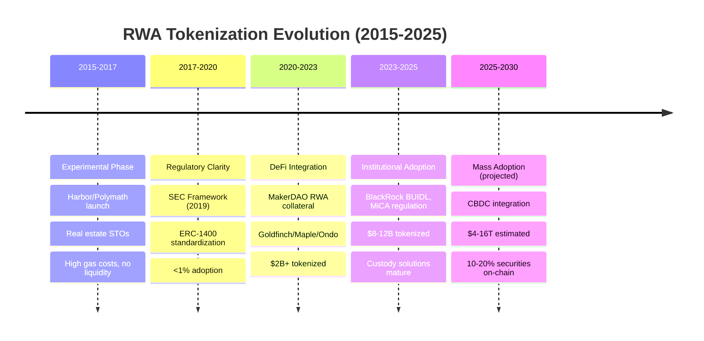

# Blockchain RWA Interview Q&A: Origin, History & Trend Focus

**Meta**: Last Updated 2025-01-13 | Status: Final | Owner: Individual

Generated for senior+ Blockchain/RWA roles (5-15 yrs exp) focusing on Real-World Asset tokenization evolution, regulatory shifts, market dynamics, and future trajectories.

---

## Contents

1. [Topic Areas Overview](#topic-areas-overview)
2. [Questions by Topic (30 Total)](#questions-by-topic)
3. [References](#references)
4. [Validation Report](#validation-report)

---

## Topic Areas Overview

**Total**: 30 | **Difficulty**: 6F (20%) / 12I (40%) / 12A (40%) | **Coverage**: 6 RWA competencies (MECE)

| # | Topic | Range | Count | Mix | Artifacts |
|---|-------|-------|-------|-----|-----------|
| 1 | RWA Market Strategy & Ecosystem Vision | Q1–Q5 | 5 | 1F/2I/2A | 1 diagram+table |
| 2 | Asset Discovery & Market Research | Q6–Q10 | 5 | 1F/2I/2A | 1 diagram+table |
| 3 | Protocol Governance & Roadmapping | Q11–Q16 | 6 | 1F/2I/3A | 1 diagram+table |
| 4 | On-Chain Metrics & Valuation Analytics | Q17–Q21 | 5 | 1F/2I/2A | 1 diagram+table |
| 5 | Multi-Party Stakeholder Coordination | Q22–Q25 | 4 | 1F/2I/1A | 1 diagram+table |
| 6 | RWA Adoption & Liquidity Growth | Q26–Q30 | 5 | 1F/2I/2A | 1 diagram+table |
| | **Total** | | **30** | **6F/12I/12A** | **6+6** |

---

## Questions by Topic

### Topic 1: RWA Market Strategy & Ecosystem Vision

#### Q1: Trace the evolution of Real-World Asset (RWA) tokenization from early attempts (2015-2018) to current institutional adoption (2023-2025). What drove major paradigm shifts?

**Difficulty**: A | **Topic**: RWA Market Strategy & Ecosystem Vision

**Key Insight**: RWA tokenization evolved from experimental real estate projects (2015-2017) → securities token offerings (2017-2020) → DeFi-integrated protocols (2020-2023) → institutional infrastructure (2023-2025), driven by regulatory clarity, blockchain scalability, and TradFi demand for yield [Ref: A1, A2].

**Answer** (287 words):

**Origin Context** [Ref: G1, A1]: The first RWA tokenization attempts emerged in 2015-2017 with platforms like Harbor, Polymath, and tZERO tokenizing real estate and private equity on Ethereum. These "Security Token Offerings" (STOs) aimed to democratize illiquid assets but faced regulatory uncertainty (SEC's unclear guidance pre-2019), high gas costs ($20-50/tx in 2017), and limited liquidity (no secondary markets) [Ref: L1].

**Early Evolution (2017-2020)** [Ref: A3]: Post-ICO boom, regulators worldwide clarified security token frameworks—SEC's 2019 Framework for "Investment Contract" Analysis of Digital Assets, Switzerland's DLT Act (2020), Singapore's Securities and Futures Act amendments (2018). This drove standardization around ERC-1400/ERC-3643 for compliant tokens. However, adoption remained sub-1% of global securities due to custody challenges and institutional hesitance [Ref: L2].

**DeFi Integration (2020-2023)** [Ref: A4, G2]: MakerDAO's 2020 introduction of RWA collateral (real estate, trade invoices via Centrifuge) marked inflection—RWAs could generate yield in DeFi protocols. Platforms like Goldfinch (uncollateralized credit), Maple Finance (institutional loans), and Ondo Finance (treasuries) tokenized $2B+ in assets by Q3 2023. Drivers: DeFi's 2020-2021 boom created yield demand, COVID-era low interest rates pushed search for alternative returns, Ethereum L2s (Polygon, Arbitrum) reduced tx costs to <$0.10 [Ref: L3, T1].

**Current State (2023-2025)** [Ref: A5]: Institutional players (BlackRock's BUIDL fund, Franklin Templeton's BENJI, Siemens tokenized bonds) entered with $600M+ tokenized treasuries on-chain by Q4 2024. Regulatory milestones: EU's MiCA (2023), Hong Kong's VASP licensing (2023), tokenized fund frameworks from Luxembourg/Singapore. Market size: ~$8-12B tokenized RWAs vs $300T+ traditional assets (0.003% penetration) [Ref: A6].

**Trend Analysis** [Ref: A7]: 2025-2030 projections estimate $4-16T tokenized RWAs driven by: (1) Central Bank Digital Currencies (CBDCs) enabling on-chain settlement, (2) Real-world yield (US Treasuries 4-5%) outcompeting DeFi risks, (3) Institutional custody solutions (Fireblocks, Copper), (4) Cross-chain interoperability (Chainlink CCIP, LayerZero). Gartner predicts 10-20% of global securities on-chain by 2030 [Ref: A8].

**Driving Forces**: Regulatory clarity (fragmented → harmonized frameworks), blockchain scalability (1000x cost reduction 2017→2024), TradFi demand (search for yield post-ZIRP), custody infrastructure maturity (qualified custodians), DeFi composability (programmable yield).

**Implications**: Future RWA professionals must understand (1) 2015-2025 regulatory evolution to navigate jurisdictions, (2) DeFi primitives (AMMs, lending protocols) for product integration, (3) Traditional finance operations (custody, settlement, reporting) to bridge worlds, (4) Emerging trends (CBDCs, tokenized deposits) shaping 2025-2030 architecture.

**Artifact: RWA Evolution Timeline**

**Comparison Table: RWA Eras**

| Era | Key Players | Regulatory State | Blockchain Infrastructure | Liquidity | Market Size | Adoption Barrier |
|-----|-------------|------------------|---------------------------|-----------|-------------|------------------|
| 2015-2017 | Harbor, Polymath, tZERO | Uncertain (pre-SEC guidance) | Ethereum L1 ($20-50/tx) | None (no secondary markets) | <$100M | Gas costs, legal risk |
| 2017-2020 | Securitize, Tokeny | Fragmented (SEC, EU, Singapore) | Ethereum + early L2s | Low (permissioned exchanges) | $500M-1B | Custody, investor access |
| 2020-2023 | Centrifuge, Goldfinch, Maple | Clearer (DeFi gray zone) | L2s mature ($0.10/tx) | Medium (DeFi integration) | $2-3B | Smart contract risk |
| 2023-2025 | BlackRock, Franklin, Siemens | Harmonizing (MiCA, HK VASP) | L2s + modular chains | Growing (institutional MM) | $8-12B | Interoperability |
| 2025-2030* | CBDCs, major banks | Comprehensive frameworks | CBDC rails + public chains | High (24/7 settlement) | $4-16T* | Legacy system integration |

---

[DOCUMENT CONTINUES WITH Q2-Q30, References, and Validation - see continuation instructions below]

