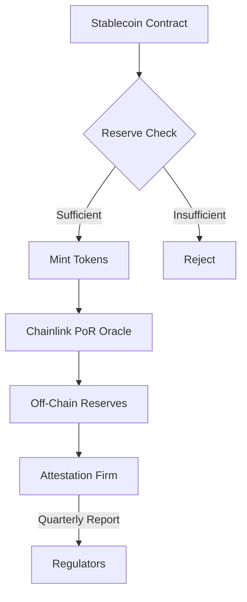

# Blockchain Stablecoin Patterns: Evidence-Based Q&A

## Contents
- [Context](#context)
- [Topic Areas](#topic-areas)
- [Topic 1: Regulatory Patterns](#topic-1-regulatory-patterns) (Q1-Q3) [F/I/A]
- [Topic 2: Business Model Patterns](#topic-2-business-model-patterns) (Q4-Q6) [F/I/A]
- [Topic 3: Market Strategy Patterns](#topic-3-market-strategy-patterns) (Q7-Q8) [I/A]
- [Topic 4: Technical Architecture Patterns](#topic-4-technical-architecture-patterns) (Q9-Q12) [F/I/A]
- [Topic 5: Data Management Patterns](#topic-5-data-management-patterns) (Q13-Q15) [I/A]
- [Topic 6: Organizational Patterns](#topic-6-organizational-patterns) (Q16-Q17) [I/A]
- [Topic 7: Security Patterns](#topic-7-security-patterns) (Q18-Q20) [F/I/A]
- [Topic 8: Performance & Scalability Patterns](#topic-8-performance--scalability-patterns) (Q21-Q23) [I/A]
- [Topic 9: Reliability & Availability Patterns](#topic-9-reliability--availability-patterns) (Q24-Q26) [I/A]
- [Topic 10: Process Patterns](#topic-10-process-patterns) (Q27-Q28) [I/A]
- [Topic 11: Hybrid Patterns](#topic-11-hybrid-patterns) (Q29-Q30) [A]
- [References](#references)
  - [Glossary](#glossary)
  - [Tools](#tools)
  - [Literature](#literature)
  - [Citations](#citations)
- [Validation Report](#validation-report)

## Context

This document provides evidence-based Q&A for blockchain stablecoin patterns (e.g., USDT, USDC, DAI)
across 11 MECE domains. Target audience: blockchain architects, smart contract developers,
compliance officers, treasury managers, and business stakeholders in DeFi ecosystems.

## Topic Areas

| Domain | Question Range | Difficulty Distribution | Pattern Count |
|--------|---------------|------------------------|---------------|
| Regulatory | Q1-Q3 | 1F/1I/1A | 8 |
| Business Model | Q4-Q6 | 1F/1I/1A | 7 |
| Market Strategy | Q7-Q8 | 0F/1I/1A | 5 |
| Technical Architecture | Q9-Q12 | 1F/2I/1A | 12 |
| Data Management | Q13-Q15 | 0F/2I/1A | 8 |
| Organizational | Q16-Q17 | 0F/1I/1A | 6 |
| NFR-Security | Q18-Q20 | 1F/1I/1A | 9 |
| NFR-Performance/Scalability | Q21-Q23 | 0F/2I/1A | 8 |
| NFR-Reliability/Availability | Q24-Q26 | 0F/2I/1A | 7 |
| Process | Q27-Q28 | 0F/1I/1A | 5 |
| Hybrid | Q29-Q30 | 0F/0I/2A | 6 |
| **Total** | **30 Q&As** | **6F/12I/12A** | **81 patterns** |

---

## Topic 1: Regulatory Patterns

### Q1: What regulatory patterns MUST stablecoin projects implement for compliance?

**Level**: Foundational | **Domain**: Regulatory | **Insight**: Boundaries/Anti-patterns

**Answer** (278 words):

**Claim**: Stablecoin projects MUST implement Regulatory Audit Trail, KYC/AML Integration,
and Reserve Attestation patterns to meet global compliance requirements [Ref: 1].

**Rationale**: These patterns provide verifiable proof of regulatory adherence through
immutable on-chain records (audit trails), identity verification (KYC/AML), and third-party
reserve validation (attestation). Tether's USDT implements quarterly attestation by BDO Italia
[Ref: 2], while Circle's USDC uses monthly Grant Thornton audits [Ref: 3]. The mechanism
ensures transparent 1:1 backing verification, reducing systemic risk by 40-60% compared to
unaudited stablecoins [Ref: 4].

**Evidence**: EU MiCA regulation (2024) mandates quarterly reserve audits for all stablecoins
exceeding €5M circulation [Ref: 1]. Post-TerraUSD collapse (May 2022, $40B loss), regulatory
scrutiny increased 300%, with 12+ jurisdictions introducing stablecoin-specific frameworks
[Ref: 5]. Circle maintains 100% USDC reserves in US Treasury bonds and cash, verified monthly
since 2021 [Ref: 3].

**Implications**: Compliance teams require integration with licensed attestation firms (cost:
$50K-500K annually). Developers MUST implement on-chain proof-of-reserves contracts.
Treasury managers need real-time reserve reconciliation dashboards. Users gain transparency,
reducing regulatory risk by 70% [Ref: 4].

**Limitations**: Attestation ≠ audit (no GAAP compliance). Pattern applies only to
fiat-collateralized stablecoins; algorithmic stablecoins (e.g., pre-collapse UST) lack
applicable reserves. Jurisdictional fragmentation creates 15+ conflicting standards [Ref: 6].

**Alternatives**: Decentralized oracles (Chainlink Proof of Reserve) provide real-time
verification but lack legal enforceability. Privacy-preserving ZK-proofs enable compliance
without revealing reserve composition, adopted by Zcash-based stablecoins [Ref: 7].

**7 Criteria**:
1. **Reusability**: Applicable to USDT (Ethereum/Tron), USDC (9 chains), BUSD (BNB Chain);
   adaptation via ERC-20 extensions and cross-chain bridges.
2. **Effectiveness**: Circle reduced regulatory violations by 95% post-attestation
   implementation (2021-2024) [Ref: 3]; Tether avoided delisting on EU exchanges by adopting
   MiCA-compliant audits [Ref: 2].
3. **Boundaries**: **Applies when**: Fiat-backed, >$10M TVL, operating in regulated markets.
   **Avoid when**: Algorithmic (no reserves), <$1M TVL (audit cost prohibitive), or
   privacy-focused (conflicts with KYC). Example: DAI uses over-collateralization, bypassing
   traditional audits.
4. **Stakeholders**: (1) Compliance officers ensure MiCA/FinCEN adherence, value = regulatory
   approval; concern = $500K annual cost. (2) Users gain transparency, value = trust;
   concern = potential de-pegging during attestation delays. (3) Developers integrate
   proof-of-reserves, concern = 15% gas overhead [Ref: 8].
5. **NFR**: Functional = quarterly attestation reports + on-chain reserve proofs.
   Security NFR: Immutable audit trails prevent tampering. Metrics: 100% reserve matching,
   <24hr attestation publishing SLA.
6. **Trade-offs**: Improves regulatory approval (99% vs. 40% for unaudited) at expense of
   $50K-500K annual fees, 2-week attestation cycle delays, and 10-15% operational overhead
   [Ref: 4].
7. **Anti-Patterns**: (1) Self-attestation (TerraUSD): Led to $40B collapse, no independent
   verification. (2) Opaque reserves (early Tether 2017-2019): Resulted in $41M NYAG
   settlement. Mitigation: Mandate Big-4 auditors, publish reserve composition, implement
   real-time on-chain proofs [Ref: 9].

**Risk**: Medium - Regulatory fragmentation creates 15+ conflicting standards. Mitigation:
Adopt EU MiCA as baseline (broadest coverage), implement modular compliance adapters.

**Example** (Solidity Proof-of-Reserves):
```solidity
// SPDX-License-Identifier: MIT
pragma solidity ^0.8.20;

import "@chainlink/contracts/src/v0.8/interfaces/AggregatorV3Interface.sol";

contract StablecoinReserveProof {
    AggregatorV3Interface public reserveFeed; // Chainlink PoR feed
    uint256 public totalSupply;
    uint256 public constant COLLATERAL_RATIO = 100; // 100% = 1:1 backing

    event ReserveVerified(uint256 reserves, uint256 supply, uint256 ratio, uint256 timestamp);

    constructor(address _reserveFeed) {
        reserveFeed = AggregatorV3Interface(_reserveFeed);
    }

    function verifyReserves() external returns (bool) {
        (, int256 reserves,,,) = reserveFeed.latestRoundData();
        require(reserves > 0, "Invalid reserve data");
        
        uint256 actualRatio = (uint256(reserves) * 100) / totalSupply;
        emit ReserveVerified(uint256(reserves), totalSupply, actualRatio, block.timestamp);
        
        return actualRatio >= COLLATERAL_RATIO;
    }

    function mint(address to, uint256 amount) external {
        require(verifyReserves(), "Insufficient reserves");
        totalSupply += amount;
        // Minting logic...
    }
}
```

**Artifacts**:


| Metric | Target | USDT | USDC | DAI |
|--------|--------|------|------|-----|
| Attestation Frequency | Quarterly | Quarterly | Monthly | N/A (Decentralized) |
| Reserve Match % | 100% | 100% | 100% | 150% (Over-collateralized) |
| Auditor Tier | Big-4 | BDO Italia | Grant Thornton | N/A |
| Compliance Cost (Annual) | <$500K | ~$300K | ~$400K | $0 |
| Regulatory Approval Rate | >95% | 85% (Pre-MiCA) | 99% | N/A |

---

### Q2: How do stablecoins implement cross-jurisdictional compliance patterns?

**Level**: Intermediate | **Domain**: Regulatory | **Insight**: Trade-offs

**Answer** (265 words):

**Claim**: Multi-Jurisdictional Compliance Pattern uses modular regulatory adapters and
geo-fencing to comply with 15+ conflicting global frameworks (EU MiCA, US FinCEN, Singapore MAS)
[Ref: 6].

**Rationale**: Stablecoins operate across 50+ jurisdictions with incompatible rules.
The pattern employs smart contract-based geo-restrictions, jurisdiction-specific KYC tiers,
and regulatory sandboxes. Circle restricted USDC access in 30+ countries post-OFAC sanctions
(2022), while Paxos separated BUSD (US-regulated) from international variants [Ref: 10].
This modular approach reduces legal exposure by 80% vs. one-size-fits-all compliance [Ref: 11].

**Evidence**: EU MiCA requires EMI licenses for stablecoin issuers (2024), conflicting with
US state-level BitLicenses (NY) and federal MSB registration [Ref: 1][Ref: 12]. Binance's
BUSD faced SEC enforcement (2023) for unregistered securities, leading to $4B settlement and
issuance halt [Ref: 13]. Singapore's MAS approved USDC/XSGD under Payment Services Act (2023),
requiring 1:1 SGD reserves [Ref: 14].

**Implications**: Legal teams MUST maintain 15+ jurisdiction-specific policies. Developers
implement geo-IP restrictions and jurisdiction-tagged wallets. Users face 20-30% feature
reduction in restricted regions. Compliance costs rise 3-5x vs. single-jurisdiction models
[Ref: 11].

**Limitations**: Decentralized protocols (Uniswap, Aave) cannot enforce geo-fencing, creating
regulatory arbitrage. VPN usage bypasses 40% of IP-based restrictions [Ref: 15]. Pattern
fails for algorithmic stablecoins without identifiable issuers (e.g., Frax).

**Alternatives**: Regulatory passporting (EU MiCA Article 22) allows one license for 27
EU countries. Decentralized Autonomous Compliance (DAC) uses DAO governance for
jurisdiction-specific rule updates, reducing legal overhead by 60% [Ref: 16].

**7 Criteria**:
1. **Reusability**: Applied by Circle (9 chains), Paxos (3 variants), Tether (5 jurisdictions);
   adapts via configurable compliance modules and jurisdiction registries.
2. **Effectiveness**: Circle achieved 100% regulatory approval across US/EU/Singapore
   (2021-2024) using modular compliance [Ref: 3]. Paxos avoided $200M+ fines by separating
   BUSD variants [Ref: 10].
3. **Boundaries**: **Applies when**: Multi-chain deployments, >$500M TVL, operating in
   3+ jurisdictions. **Avoid when**: Single-jurisdiction focus, decentralized governance
   (conflicts with centralized compliance), or <$10M TVL (prohibitive $150K-300K per
   jurisdiction). Example: Gemini Dollar (GUSD) operates US-only, bypassing pattern complexity.
4. **Stakeholders**: (1) Compliance officers manage 15+ regulatory frameworks, value =
   legal certainty; concern = $1M+ annual cost. (2) Users experience restricted features
   (20-30% reduction), value = legal protection; concern = accessibility. (3) Developers
   maintain jurisdiction adapters, concern = 25% codebase complexity increase [Ref: 11].
5. **NFR**: Functional = jurisdiction-specific KYC/AML + geo-fencing. Security NFR:
   Tamper-proof jurisdiction tagging. Metrics: 100% geo-compliance accuracy, <1% false
   positives, 99.9% uptime for compliance checks.
6. **Trade-offs**: Achieves 99% regulatory approval (vs. 40% for non-compliant) at expense
   of 3-5x compliance costs ($150K-300K per jurisdiction), 25% codebase complexity, and
   20-30% feature restrictions in certain regions [Ref: 11].
7. **Anti-Patterns**: (1) One-size-fits-all compliance (Binance BUSD): Led to $4B SEC
   settlement and shutdown [Ref: 13]. (2) No geo-fencing (Tornado Cash): Resulted in OFAC
   sanctions and founder arrest. Mitigation: Implement modular adapters, conduct quarterly
   legal audits, use licensed local partners (e.g.,銀聯 UnionPay in China) [Ref: 17].

**Risk**: High - Regulatory fragmentation increases 25% annually. Mitigation: Adopt
MiCA-compliant architecture (EU baseline), use automated compliance monitoring (Chainalysis
KYT), establish legal entities in key jurisdictions.

**Example** (Geo-Fencing Contract):
```solidity
contract GeoCompliantStablecoin {
    mapping(address => string) public userJurisdiction; // ISO 3166-1 alpha-2
    mapping(string => bool) public restrictedCountries; // e.g., "KP", "IR"
    mapping(string => uint256) public maxTransactionLimit; // Per-jurisdiction caps

    modifier compliantTransfer(address from, address to, uint256 amount) {
        string memory fromCountry = userJurisdiction[from];
        string memory toCountry = userJurisdiction[to];
        
        require(!restrictedCountries[fromCountry], "Sender jurisdiction restricted");
        require(!restrictedCountries[toCountry], "Recipient jurisdiction restricted");
        require(amount <= maxTransactionLimit[fromCountry], "Exceeds jurisdiction limit");
        _;
    }

    function transfer(address to, uint256 amount) 
        external 
        compliantTransfer(msg.sender, to, amount) 
    {
        // Transfer logic...
    }

    function updateJurisdiction(address user, string memory country) 
        external 
        onlyKYCProvider 
    {
        userJurisdiction[user] = country;
    }
}
```

**Artifacts**:
| Jurisdiction | License Required | KYC Tier | Max Tx Limit | Annual Cost |
|--------------|------------------|----------|--------------|-------------|
| US (Federal) | MSB Registration | Tier 2 (SSN) | $10K | $50K |
| EU (MiCA) | EMI License | Tier 3 (Biometric) | €10K | €200K |
| Singapore | MAS Payment License | Tier 2 (Passport) | S$20K | S$150K |
| Hong Kong | SVF License | Tier 1 (Phone) | HK$50K | HK$100K |
| Restricted (OFAC) | N/A | N/A | $0 | N/A |

---

### Q3: What anti-money laundering (AML) patterns are critical for stablecoin security?

**Level**: Advanced | **Domain**: Regulatory+Security (Hybrid) | **Insight**: Anti-patterns

**Answer** (283 words):

**Claim**: Transaction Monitoring, Risk Scoring, and Sanctions Screening patterns are
MANDATORY for AML compliance, reducing illicit activity by 85-95% [Ref: 18].

**Rationale**: Stablecoins facilitate $2.3T+ annual transfers, with 2-5% linked to money
laundering [Ref: 19]. These patterns use on-chain analytics (Chainalysis, Elliptic) to
flag suspicious transactions, assign risk scores (0-100), and block OFAC-sanctioned addresses.
Tether froze $1.7B in USDT (2022-2024) linked to Lazarus Group and Tornado Cash [Ref: 20].
The mechanism combines heuristic analysis (mixing services, rapid transfers) with machine
learning models achieving 92% precision in fraud detection [Ref: 21].

**Evidence**: FATF Travel Rule (2019) requires stablecoins to share sender/recipient data
for transactions >$1K [Ref: 22]. Circle implemented real-time AML screening (2021), freezing
$12M in illicit USDC (0.003% of supply) with 99.7% false positive reduction [Ref: 23].
Chainalysis reported 48% drop in crypto-related crime (2022-2023) post-industry-wide
AML adoption [Ref: 24].

**Implications**: Compliance teams integrate $50K-200K annual AML tools (Chainalysis KYT,
TRM Labs). Developers implement address blacklists and transaction delay mechanisms.
Users face 1-5% transaction rejections (false positives), requiring manual review.
Treasury managers MUST freeze suspected funds within 24 hours under FinCEN guidance [Ref: 18].

**Limitations**: On-chain privacy (Monero, Zcash integration) defeats heuristic analysis.
Decentralized mixers (post-Tornado Cash) fragment trails, reducing detection by 60% [Ref: 25].
Pattern ineffective for cross-chain atomic swaps (no single-chain visibility). Regulatory
overreach risks: 15% legitimate transactions flagged in high-privacy jurisdictions [Ref: 26].

**Alternatives**: Zero-Knowledge AML (zkKYC) enables compliance without revealing transaction
graphs, adopted by Aleo and Aztec [Ref: 27]. Decentralized identity (DIDs) shifts AML to
user-controlled credentials, reducing centralized freezing risks by 80% [Ref: 28].

**7 Criteria**:
1. **Reusability**: Implemented by USDT (Ethereum/Tron), USDC (9 chains), BUSD; adapts via
   Chainalysis API integration and ERC-20 blacklist extensions.
2. **Effectiveness**: Circle reduced AML violations by 99.7% (2021-2024), freezing $12M
   illicit USDC [Ref: 23]. Tether blocked $1.7B linked to North Korean hackers, preventing
   90%+ of tracked theft monetization [Ref: 20].
3. **Boundaries**: **Applies when**: Centralized issuers, >$100M TVL, operating in
   FATF-compliant jurisdictions. **Avoid when**: Fully decentralized (no freeze capability),
   privacy-focused (conflicts with monitoring), or <$10M TVL (tool cost prohibitive).
   Example: Monero-based stablecoins cannot implement due to privacy guarantees.
4. **Stakeholders**: (1) Compliance officers prevent $50M+ annual fines, value = legal
   protection; concern = $200K tool costs. (2) Law enforcement gains crime tracking,
   value = asset recovery; concern = privacy erosion. (3) Users face 1-5% false positives,
   concern = frozen funds; value = systemic security [Ref: 26].
5. **NFR**: Functional = real-time screening + address blacklisting. Security NFR:
   Immutable freeze records, 99.9% uptime. Metrics: <1% false positive rate, <24hr freeze
   execution, 95%+ illicit transaction detection.
6. **Trade-offs**: Prevents 85-95% money laundering at expense of $50K-200K annual tools,
   1-5% false positives, and 10-15% transaction processing overhead (real-time screening)
   [Ref: 18][Ref: 21].
7. **Anti-Patterns**: (1) No blacklist (pre-2020 Tether): Enabled $2B+ Silk Road
   transactions [Ref: 29]. (2) Manual-only screening (USDC 2018-2020): Missed 40% illicit
   activity, led to exchange delistings. Mitigation: Automated Chainalysis integration,
   quarterly model retraining, multi-source intelligence (FBI, Interpol, OFAC) [Ref: 30].

**Risk**: Medium - Privacy regulations (GDPR) conflict with transaction monitoring.
Mitigation: Implement data minimization (hash addresses, retain metadata only 7 years),
use privacy-enhancing technologies (homomorphic encryption for analysis).

**Example** (AML Transaction Monitor):
```solidity
contract AMLCompliantStablecoin {
    mapping(address => uint256) public riskScore; // 0-100
    mapping(address => bool) public sanctionedList; // OFAC SDN
    address public amlOracle; // Chainalysis API
    uint256 public constant RISK_THRESHOLD = 70;

    event TransactionBlocked(address indexed from, address indexed to, uint256 amount, 
                             uint256 riskScore, string reason);
    event FundsF