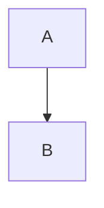

# Export Markdown to PDF (with Mermaid diagrams)

This note records reliable ways to convert Markdown files to PDF while rendering Mermaid diagrams. Put this file in `Workplace/Interview/Prompts` so you can reuse the steps later.

## Quick summary

Two recommended approaches that worked in this environment:

- Method A — pandoc + mermaid-filter (recommended when you prefer pandoc formatting control)
- Method B — md-to-pdf (simpler, all-in-one, uses Puppeteer/Chromium)

Both approaches require Node/npm for the mermaid tooling. A third approach is to pre-render Mermaid diagrams with `mermaid-cli` (`mmdc`) and include the generated images in your Markdown.

---

## Prerequisites

- A working Linux environment with `bash` shell.
- `pandoc` (for Method A) and optionally `wkhtmltopdf` or other pdf-engine.
- `node` and `npm` (for mermaid tooling and filters).
- `mermaid-cli`, `mermaid-filter`, and/or `md-to-pdf` installed globally (commands shown below).

Install common packages (Debian/Ubuntu example):

```bash
# system packages
sudo apt update
sudo apt install -y pandoc wkhtmltopdf

# or install pandoc/wkhtmltopdf via your distro package manager if not present

# Node tools (global install)
npm install -g @mermaid-js/mermaid-cli mermaid-filter md-to-pdf
```

Note: global npm installs usually put binaries in a location like `/usr/local/bin` or `~/.npm-global/bin`; ensure that directory is in your `PATH`.

---

## Method A — pandoc + mermaid-filter (best control)

Why: `pandoc` provides powerful Markdown->PDF conversion and template control. The `mermaid-filter` preprocesses Mermaid code blocks into images (SVG/PNG) so pandoc will include them in the final PDF.

1. Ensure `mermaid-filter` and `@mermaid-js/mermaid-cli` are available (used by the filter to render diagrams).

2. Run pandoc with the filter and a PDF engine (we used `wkhtmltopdf` in this environment):

```bash
cd /path/to/markdown/folder
pandoc your-file.md -o your-file.pdf --filter mermaid-filter --pdf-engine=wkhtmltopdf
```

Notes and tips:
- If you see a warning like "This document format requires a nonempty <title> element", you can provide a title via metadata:

```bash
pandoc your-file.md -o your-file.pdf --filter mermaid-filter --pdf-engine=wkhtmltopdf --metadata title="My Doc Title"
```

- The `mermaid-filter` will typically create temporary SVG or PNG images and insert them into the pandoc document before PDF rendering.
- If diagrams don't render, confirm Mermaid code blocks are fenced like this:

```markdown

```

(no extra language hints; the first token after the triple backticks should be `mermaid`).

---

## Method B — md-to-pdf (easier, all-in-one)

Why: `md-to-pdf` uses Puppeteer/Chromium to render Markdown (and supports Mermaid) and produces a PDF with minimal configuration.

1. Install `md-to-pdf` (if not already):

```bash
npm install -g md-to-pdf
```

2. Convert a file:

```bash
cd /path/to/markdown/folder
md-to-pdf your-file.md
```

This will create `your-file.pdf` in the same folder. `md-to-pdf` automatically processes Mermaid code blocks.

Notes:
- It uses Chromium (Puppeteer). If Chromium is missing or `md-to-pdf` fails to download it, install Chromium/Chrome and/or set the `PUPPETEER_SKIP_DOWNLOAD` and provide a system chromium path. See `md-to-pdf` docs for details.
- `md-to-pdf` is convenient but offers less fine-grained layout control than pandoc.

---

## Method C — Pre-render Mermaid diagrams (universal fallback)

Why: If you want full control or to avoid extra filters, render diagrams to images yourself and reference them in the Markdown.

1. Create a separate `.mmd` file (or extract the mermaid block to a temp file) and render with `mmdc` (mermaid-cli):

```bash
# install if needed
npm install -g @mermaid-js/mermaid-cli

# render a diagram file
mmdc -i diagram.mmd -o diagram.png
```

2. Replace the mermaid block in your Markdown with an image link:

```markdown

```

3. Convert the Markdown to PDF using your preferred tool (`pandoc`, `md-to-pdf`, etc.).

This approach is robust and works when filters fail.

---

## Troubleshooting

- Diagrams not showing:
  - Confirm the mermaid code fence is exactly ```` ```mermaid ```` with no extra text.
  - Check that `mermaid-filter` / `mmdc` binaries are in `PATH` (`which mmdc`, `which mermaid-filter`).
  - If using `pandoc` + `mermaid-filter`, ensure the `mermaid-filter` can find `mmdc` (it uses the mermaid CLI internally).

- Image quality: prefer SVG output for vector images (if your toolchain supports it). `mermaid-filter` may produce SVG which `pandoc` embeds well.

- Title warnings: Use `--metadata title="My Title"` or add a YAML frontmatter title to the Markdown:

```yaml
---
title: My Title
author: Me
---
```

- PATH issues after `npm -g` installs: log out/in or add the global npm bin dir to your `PATH`. Example to add `~/.npm-global/bin` to PATH in `~/.profile`:

```bash
export PATH="$HOME/.npm-global/bin:$PATH"
```

---

## Example (the commands used in this session)

```bash
# Method A (pandoc + mermaid-filter)
cd /home/zealy/nas/github/ljg-cqu/knowledge/Workplace/Interview/Blockchain/Posts/BlockchainArchitecture\(RWA\)
pandoc BlockchainArchitecture_RideHailing_RWA_Guidance.md -o BlockchainArchitecture_RideHailing_RWA_Guidance.pdf --filter mermaid-filter --pdf-engine=wkhtmltopdf

# Method B (md-to-pdf)
cd /home/zealy/nas/github/ljg-cqu/knowledge/Workplace/Interview/Blockchain/Posts/BlockchainArchitecture\(RWA\)
md-to-pdf BlockchainArchitecture_RideHailing_RWA_Guidance.md
```

(Those commands were used during the verification in this environment.)

---

## Verification

After generating the PDF, open it with a PDF viewer and check that:
- All Mermaid diagrams appear and are readable.
- The document title, headings, and tables render correctly.

If anything missing, try Method C (pre-render diagrams) as a fallback.

---

## Next steps / Notes

- If you want, I can:
  - Commit this note to the repository (make a git commit) and push it.
  - Add a short script `tools/export-md-to-pdf.sh` that wraps the recommended commands for reuse.

File location:

`/home/zealy/nas/github/ljg-cqu/knowledge/Workplace/Interview/Prompts/Export_Markdown_to_PDF_with_Mermaid.md`

